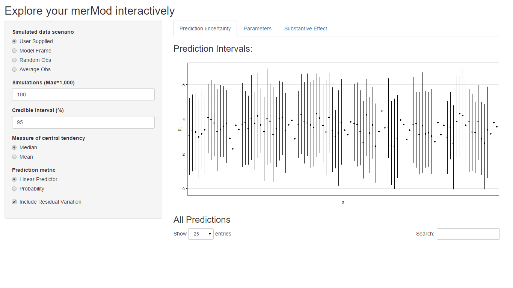

---
output:
  md_document:
    variant: gfm
---


[](https://travis-ci.org/jknowles/merTools)
[](https://coveralls.io/r/jknowles/merTools?branch=master)
[](https://github.com/jknowles/merTools/issues)
[](https://github.com/jknowles/merTools/pulls)
[](https://cran.r-project.org/package=merTools)
[](https://cran.r-project.org/package=merTools)
[](https://cran.r-project.org/package=merTools)
[](http://depsy.org/package/r/merTools)

<!-- README.md is generated from README.Rmd. Please edit that file -->

```{r, echo = FALSE}
knitr::opts_chunk$set(
  collapse = TRUE, echo = TRUE,
  comment = "#>",
  fig.path = "man/figures/README_"
)
```

# merTools

A package for getting the most of our multilevel models in R

by Jared E. Knowles and Carl Frederick

Working with generalized linear mixed models (GLMM) and linear mixed models (LMM) 
has become increasingly easy with advances in the `lme4` package. 
As we have found ourselves using these models more and more within our work, we, 
the authors, have developed a set of tools for simplifying and speeding up common 
tasks for interacting with `merMod` objects from `lme4`. This package provides 
those tools. 

## Installation


```{r, echo = TRUE, eval = FALSE}
# development version
library(devtools)
install_github("jknowles/merTools")

# CRAN version
install.packages("merTools")
```

## Recent Updates

### merTools 0.5.0

#### New Features

- `subBoot` now works with `glmerMod` objects as well
- `reMargins` a new function that allows the user to marginalize the prediction over breaks in the 
distribution of random effect distributions, see `?reMargins` and the new `reMargins` vignette (closes #73)

#### Bug fixes

- Fixed an issue where known convergence errors were issuing warnings and causing the test suite 
to not work
- Fixed an issue where models with a random slope, no intercept, and no fixed term were unable 
to be predicted (#101)
- Fixed an issue with shinyMer not working with substantive fixed effects (#93)


### merTools 0.4.1

#### New Features
- Standard errors reported by `merModList` functions now apply the Rubin 
correction for multiple imputation

#### Bug fixes
- Contribution by Alex Whitworth (@alexWhitworth) adding error checking to plotting
functions

### merTools 0.4.0

#### New Features
- Added vignette on using multilevel models with multiply imputed data
- Added `fixef` and `ranef` generics for `merModList` objects
- Added `fastdisp` generic for `merModList`
- Added `summary` generic for `merModList`
- Added `print` generic for `merModList`
- Documented all generics for `merModList` including examples and a new 
imputation vignette
- Added `modelInfo` generic for `merMod` objects that provides simple summary 
stats about a whole model

#### Bug Fixes
- Fix bug that returned NaN for `std.error` of a multiply imputed `merModList` 
when calling `modelRandEffStats`
- Fixed bug in `REimpact` where some column names in `newdata` would prevent the 
prediction intervals from being computed correctly. Users will now be warned.
- Fixed bug in `wiggle` where documentation incorrectly stated the arguments to 
the function and the documentation did not describe function correctly

See [NEWS.md](https://github.com/jknowles/merTools/blob/master/NEWS.md) for 
more details. 

## Shiny App and Demo

The easiest way to demo the features of this application is to use the bundled 
Shiny application which launches a number of the metrics here to aide in exploring 
the model. To do this:

```{r, echo = TRUE, eval=FALSE}
library(merTools)
m1 <- lmer(y ~ service + lectage + studage + (1|d) + (1|s), data=InstEval)
shinyMer(m1, simData = InstEval[1:100, ]) # just try the first 100 rows of data
```

```{r, include=FALSE}
library(merTools)
m1 <- lmer(y ~ service + lectage + studage + (1|d) + (1|s), data=InstEval)
```



On the first tab, the function presents the prediction intervals for the data 
selected by user which are calculated using the `predictInterval` function 
within the package. This function calculates prediction intervals quickly by 
sampling from the simulated distribution of the fixed effect and random effect 
terms and combining these simulated estimates to produce a distribution of 
predictions for each observation. This allows prediction intervals to be generated 
from very large models where the use of `bootMer` would not be feasible 
computationally. 


On the next tab the distribution of the fixed effect and group-level effects 
is depicted on confidence interval plots. These are useful for diagnostics and 
provide a way to inspect the relative magnitudes of various parameters. This 
tab makes use of four related functions in `merTools`: `FEsim`, `plotFEsim`, 
`REsim` and `plotREsim` which are available to be used on their own as well. 


On the third tab are some convenient ways to show the influence or magnitude of 
effects by leveraging the power of `predictInterval`. For each case, up to 12, 
in the selected data type, the user can view the impact of changing either one 
of the fixed effect or one of the grouping level terms. Using the `REimpact` 
function, each case is simulated with the model's prediction if all else was 
held equal, but the observation was moved through the distribution of the 
fixed effect or the random effect term. This is plotted on the scale of the 
dependent variable, which allows the user to compare the magnitude of effects 
across variables, and also between models on the same data. 

## Predicting

Standard prediction looks like so. 

```{r}
predict(m1, newdata = InstEval[1:10, ])
```

With `predictInterval` we obtain predictions that are more like the standard 
objects produced by `lm` and `glm`:

```{r}
#predictInterval(m1, newdata = InstEval[1:10, ]) # all other parameters are optional
predictInterval(m1, newdata = InstEval[1:10, ], n.sims = 500, level = 0.9, 
                stat = 'median')
```

Note that `predictInterval` is slower because it is computing simulations. It 
can also return all of the simulated `yhat` values as an attribute to the 
predict object itself. 

`predictInterval` uses the `sim` function from the `arm` package heavily to 
draw the distributions of the parameters of the model. It then combines these 
simulated values to create a distribution of the `yhat` for each observation. 

### Inspecting the Prediction Components

We can also explore the components of the prediction interval by asking 
`predictInterval` to return specific components of the prediction interval. 

```{r}
predictInterval(m1, newdata = InstEval[1:10, ], n.sims = 200, level = 0.9, 
                stat = 'median', which = "all")
```

This can lead to some useful plotting:

```{r}
library(ggplot2)
plotdf <- predictInterval(m1, newdata = InstEval[1:10, ], n.sims = 2000, 
                          level = 0.9, stat = 'median', which = "all", 
                          include.resid.var = FALSE)
plotdfb <- predictInterval(m1, newdata = InstEval[1:10, ], n.sims = 2000, 
                          level = 0.9, stat = 'median', which = "all", 
                          include.resid.var = TRUE)

plotdf <- dplyr::bind_rows(plotdf, plotdfb, .id = "residVar")
plotdf$residVar <- ifelse(plotdf$residVar == 1, "No Model Variance", 
                          "Model Variance")

ggplot(plotdf, aes(x = obs, y = fit, ymin = lwr, ymax = upr)) + 
  geom_pointrange() +
  geom_hline(yintercept = 0, color = I("red"), size = 1.1) +
  scale_x_continuous(breaks = c(1, 10)) +
  facet_grid(residVar~effect) + theme_bw()

```

We can also investigate the makeup of the prediction for each observation.

```{r}
ggplot(plotdf[plotdf$obs < 6,], 
       aes(x = effect, y = fit, ymin = lwr, ymax = upr)) + 
  geom_pointrange() +
  geom_hline(yintercept = 0, color = I("red"), size = 1.1) +
  facet_grid(residVar~obs) + theme_bw()
```

## Plotting

`merTools` also provides functionality for inspecting `merMod` objects visually. 
The easiest are getting the posterior distributions of both fixed and random 
effect parameters. 

```{r}
feSims <- FEsim(m1, n.sims = 100)
head(feSims)
```

And we can also plot this:

```{r FEsimPlot}
plotFEsim(FEsim(m1, n.sims = 100), level = 0.9, stat = 'median', intercept = FALSE)
```

We can also quickly make caterpillar plots for the random-effect terms:

```{r}
reSims <- REsim(m1, n.sims = 100)
head(reSims)
```

```{r reSimplot}
plotREsim(REsim(m1, n.sims = 100), stat = 'median', sd = TRUE)
```

Note that `plotREsim` highlights group levels that have a simulated distribution 
that does not overlap 0 -- these appear darker. The lighter bars represent 
grouping levels that are not distinguishable from 0 in the data. 

Sometimes the random effects can be hard to interpret and not all of them are 
meaningfully different from zero. To help with this `merTools` provides the 
`expectedRank` function, which provides the percentile ranks for the observed 
groups in the random effect distribution taking into account both the magnitude 
and uncertainty of the estimated effect for each group. 

```{r}
ranks <- expectedRank(m1, groupFctr = "d")
head(ranks)
```

A nice features `expectedRank` is that you can return the expected rank for all 
factors simultaneously and use them:

```{r}
ranks <- expectedRank(m1)
head(ranks)

ggplot(ranks, aes(x = term, y = estimate)) + 
  geom_violin(fill = "gray50") + facet_wrap(~groupFctr) +
  theme_bw()
```

## Effect Simulation

It can still be difficult to interpret the results of LMM and GLMM models, 
especially the relative influence of varying parameters on the predicted outcome. 
This is where the `REimpact` and the `wiggle` functions in `merTools` can be 
handy. 

```{r}
impSim <- REimpact(m1, InstEval[7, ], groupFctr = "d", breaks = 5, 
                   n.sims = 300, level = 0.9)
impSim
```

The result of `REimpact` shows the change in the `yhat` as the case we supplied to 
`newdata` is moved from the first to the fifth quintile in terms of the magnitude 
of the group factor coefficient. We can see here that the individual professor 
effect has a strong impact on the outcome variable. This can be shown graphically 
as well:

```{r reImpactplot}
ggplot(impSim, aes(x = factor(bin), y = AvgFit, ymin = AvgFit - 1.96*AvgFitSE, 
                   ymax = AvgFit + 1.96*AvgFitSE)) + 
  geom_pointrange() + theme_bw() + labs(x = "Bin of `d` term", y = "Predicted Fit")
```

Here the standard error is a bit different -- it is the weighted standard error 
of the mean effect within the bin. It does not take into account the variability 
within the effects of each observation in the bin -- accounting for this variation 
will be a future addition to `merTools`. 

## Explore Substantive Impacts

Another feature of `merTools` is the ability to easily generate hypothetical 
scenarios to explore the predicted outcomes of a `merMod` object and 
understand what the model is saying in terms of the outcome variable. 

Let's take the case where we want to explore the impact of a model with 
an interaction term between a category and a continuous predictor. First, 
we fit a model with interactions:

```{r substImpact}
data(VerbAgg)
fmVA <- glmer(r2 ~ (Anger + Gender + btype + situ)^2 +
 		   (1|id) + (1|item), family = binomial, 
 		   data = VerbAgg)
```

Now we prep the data using the `draw` function in `merTools`. Here we 
draw the average observation from the model frame. We then `wiggle` the 
data by expanding the dataframe to include the same observation repeated 
but with different values of the variable specified by the `var` 
parameter. Here, we expand the dataset to all values of `btype`, `situ`, 
and `Anger` subsequently. 

```{r substImpactPrepData}
# Select the average case
newData <- draw(fmVA, type = "average")
newData <- wiggle(newData, varlist = "btype", 
                  valueslist = list(unique(VerbAgg$btype)))
newData <- wiggle(newData, var = "situ", 
                  valueslist = list(unique(VerbAgg$situ)))
newData <- wiggle(newData, var = "Anger", 
                  valueslist = list(unique(VerbAgg$Anger)))
head(newData, 10)
```

The next step is familiar -- we simply pass this new dataset to 
`predictInterval` in order to generate predictions for these counterfactuals. 
Then we plot the predicted values against the continuous variable, `Anger`, 
and facet and group on the two categorical variables `situ` and `btype` 
respectively.

```{r substImpactPredict}
plotdf <- predictInterval(fmVA, newdata = newData, type = "probability", 
            stat = "median", n.sims = 1000)
plotdf <- cbind(plotdf, newData)

ggplot(plotdf, aes(y = fit, x = Anger, color = btype, group = btype)) + 
  geom_point() + geom_smooth(aes(color = btype), method = "lm") + 
  facet_wrap(~situ) + theme_bw() +
  labs(y = "Predicted Probability")
```

## Marginalizing Random Effects

```{r}
# get cases
case_idx <- sample(1:nrow(VerbAgg), 10)
mfx <- REmargins(fmVA, newdata = VerbAgg[case_idx,], breaks = 4, groupFctr = "item", 
                 type = "probability")

ggplot(mfx, aes(y = fit_combined, x = breaks, group = case)) + 
  geom_point() + geom_line() + 
  theme_bw() + 
  scale_y_continuous(breaks = 1:10/10, limits = c(0, 1)) +
  coord_cartesian(expand = FALSE) +
  labs(x = "Quartile of item random effect Intercept for term 'item'", 
       y = "Predicted Probability", 
       title = "Simulated Effect of Item Intercept on Predicted Probability for 10 Random Cases")
```


