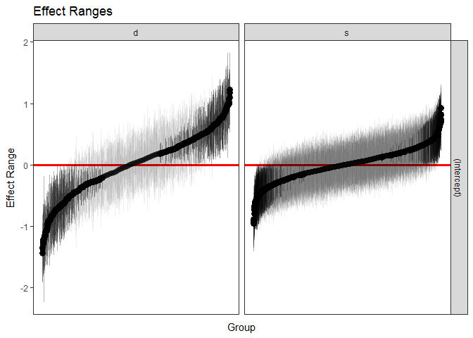
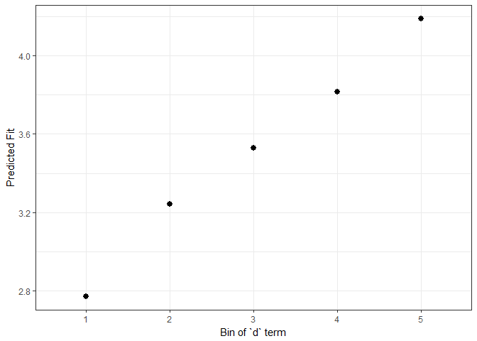
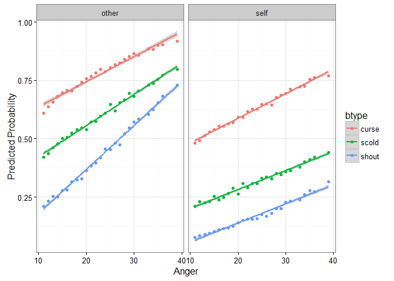

<!-- README.md is generated from README.Rmd. Please edit that file -->
merTools
========

A package for getting the most of our multilevel models in R

by Jared E. Knowles and Carl Frederick

[](https://travis-ci.org/jknowles/merTools) [](https://coveralls.io/r/jknowles/merTools?branch=master) [](https://github.com/jknowles/merTools/issues) [](https://github.com/jknowles/merTools/pulls) [](https://cran.r-project.org/package=merTools) [](https://cran.rstudio.com/web/packages/merTools/index.html)

Working with generalized linear mixed models (GLMM) and linear mixed models (LMM) has become increasingly easy with advances in the `lme4` package. As we have found ourselves using these models more and more within our work, we, the authors, have developed a set of tools for simplifying and speeding up common tasks for interacting with `merMod` objects from `lme4`. This package provides those tools.

Installation
------------

``` r
# development version
library(devtools)
install_github("jknowles/merTools")

# CRAN version
install.packages("merTools")
```

Recent Updates
--------------

### Version 0.2

### New Functionality

-   Substantial performance enhancement for `predictInterval` which includes better handling of large numbers of parameters and simulations, performance tweaks for added speed (~10x), and parallel backend support (currently not optimized)
-   Add support for `probit` models and limited support for other `glmm` link functions, with warning (still do not know how to handle sigma parameter for these)
-   Add ability for user-specified seed for reproducibility
-   Add support for `blmerMod` and `bglmerMod` objects from the `blme` package
-   Add a `merModList` object for lists of `merMod` objects fitted to subsets of a dataset, useful for imputation or for working with extremely large datasets
-   Add a `print` method for `merModList` to mimic output of `summary.merMod`
-   Add a `VarCorr` method for `merModList`
-   Add new package data to demonstrate replication from selected published texts on multilevel modeling using different software (1982 High School and Beyond Survey data)

### Other changes

-   Changed the default `n.sims` for the `predictInterval` function from 100 to 1,000 to give better coverage and reflect performance increase
-   Changed the default for `level` in `predictInterval` to be 0.8 instead of 0.95 to reflect that 0.95 prediction intervals are more conservative than most users need

See [NEWS.md](https://github.com/jknowles/merTools/blob/master/NEWS.md) for more details.

Shiny App and Demo
------------------

The easiest way to demo the features of this application is to use the bundled Shiny application which launches a number of the metrics here to aide in exploring the model. To do this:

``` r
devtools::install_github("jknowles/merTools")
library(merTools)
m1 <- lmer(y ~ service + lectage + studage + (1|d) + (1|s), data=InstEval)
shinyMer(m1, simData = InstEval[1:100, ]) # just try the first 100 rows of data
```


On the first tab, the function presents the prediction intervals for the data selected by user which are calculated using the `predictInterval` function within the package. This function calculates prediction intervals quickly by sampling from the simulated distribution of the fixed effect and random effect terms and combining these simulated estimates to produce a distribution of predictions for each observation. This allows prediction intervals to be generated from very large models where the use of `bootMer` would not be feasible computationally.


On the next tab the distribution of the fixed effect and group-level effects is depicted on confidence interval plots. These are useful for diagnostics and provide a way to inspect the relative magnitudes of various parameters. This tab makes use of four related functions in `merTools`: `FEsim`, `plotFEsim`, `REsim` and `plotREsim` which are available to be used on their own as well.


On the third tab are some convenient ways to show the influence or magnitude of effects by leveraging the power of `predictInterval`. For each case, up to 12, in the selected data type, the user can view the impact of changing either one of the fixed effect or one of the grouping level terms. Using the `REimpact` function, each case is simulated with the model's prediction if all else was held equal, but the observation was moved through the distribution of the fixed effect or the random effect term. This is plotted on the scale of the dependent variable, which allows the user to compare the magnitude of effects across variables, and also between models on the same data.

Predicting
----------

Standard prediction looks like so.

``` r
predict(m1, newdata = InstEval[1:10, ])
#>        1        2        3        4        5        6        7        8 
#> 3.146336 3.165211 3.398499 3.114248 3.320686 3.252670 4.180896 3.845218 
#>        9       10 
#> 3.779336 3.331012
```

With `predictInterval` we obtain predictions that are more like the standard objects produced by `lm` and `glm`:

``` r
#predictInterval(m1, newdata = InstEval[1:10, ]) # all other parameters are optional
predictInterval(m1, newdata = InstEval[1:10, ], n.sims = 500, level = 0.9, 
                stat = 'median')
#>         fit      upr      lwr
#> 1  3.287559 5.300586 1.104040
#> 2  3.229892 5.075207 1.153660
#> 3  3.307726 5.470449 1.311966
#> 4  3.053471 5.018208 1.299256
#> 5  3.437312 5.337975 1.375065
#> 6  3.296146 5.235116 1.500297
#> 7  4.236472 6.235952 2.184523
#> 8  3.801851 5.688499 1.963856
#> 9  3.784415 5.804556 1.815676
#> 10 3.204516 5.232257 1.286672
```

Note that `predictInterval` is slower because it is computing simulations. It can also return all of the simulated `yhat` values as an attribute to the predict object itself.

`predictInterval` uses the `sim` function from the `arm` package heavily to draw the distributions of the parameters of the model. It then combines these simulated values to create a distribution of the `yhat` for each observation.

Plotting
--------

`merTools` also provides functionality for inspecting `merMod` objects visually. The easiest are getting the posterior distributions of both fixed and random effect parameters.

``` r
feSims <- FEsim(m1, n.sims = 100)
head(feSims)
#>          term        mean      median         sd
#> 1 (Intercept)  3.22635911  3.22726590 0.01868970
#> 2    service1 -0.06862613 -0.06853439 0.01152868
#> 3   lectage.L -0.18628196 -0.18817151 0.01448635
#> 4   lectage.Q  0.02315816  0.02379139 0.01066136
#> 5   lectage.C -0.02355269 -0.02380259 0.01076683
#> 6   lectage^4 -0.01967984 -0.01908929 0.01430187
```

And we can also plot this:

``` r
plotFEsim(FEsim(m1, n.sims = 100), level = 0.9, stat = 'median', intercept = FALSE)
```

<!-- -->

We can also quickly make caterpillar plots for the random-effect terms:

``` r
reSims <- REsim(m1, n.sims = 100)
head(reSims)
#>   groupFctr groupID        term        mean      median        sd
#> 1         s       1 (Intercept)  0.20497338  0.22567935 0.3190433
#> 2         s       2 (Intercept) -0.05233047 -0.06646264 0.2861745
#> 3         s       3 (Intercept)  0.31615388  0.30443395 0.2841719
#> 4         s       4 (Intercept)  0.23736099  0.24449046 0.2956142
#> 5         s       5 (Intercept)  0.05754080  0.07431858 0.3131179
#> 6         s       6 (Intercept)  0.07356456  0.06119731 0.2473840
```

``` r
plotREsim(REsim(m1, n.sims = 100), stat = 'median', sd = TRUE)
```

<!-- -->

Note that `plotREsim` highlights group levels that have a simulated distribution that does not overlap 0 -- these appear darker. The lighter bars represent grouping levels that are not distinguishable from 0 in the data.

Sometimes the random effects can be hard to interpret and not all of them are meaningfully different from zero. To help with this `merTools` provides the `expectedRank` function, which provides the percentile ranks for the observed groups in the random effect distribution taking into account both the magnitude and uncertainty of the estimated effect for each group.

``` r
ranks <- expectedRank(m1, groupFctr = "d")
head(ranks)
#>      d (Intercept) (Intercept)_var       ER pctER
#> 1 1866   1.2553612     0.012755634 1123.806   100
#> 2 1258   1.1674851     0.034291227 1115.766    99
#> 3  240   1.0933372     0.008761218 1115.090    99
#> 4   79   1.0998652     0.023095979 1112.315    99
#> 5  676   1.0169070     0.026562174 1101.553    98
#> 6   66   0.9568607     0.008602823 1098.049    97
```

Effect Simulation
-----------------

It can still be difficult to interpret the results of LMM and GLMM models, especially the relative influence of varying parameters on the predicted outcome. This is where the `REimpact` and the `wiggle` functions in `merTools` can be handy.

``` r
impSim <- REimpact(m1, InstEval[7, ], groupFctr = "d", breaks = 5, 
                   n.sims = 300, level = 0.9)
#> Warning: executing %dopar% sequentially: no parallel backend registered
impSim
#>   case bin   AvgFit     AvgFitSE nobs
#> 1    1   1 3.212654 3.286716e-05  193
#> 2    1   2 3.218521 3.130432e-05  240
#> 3    1   3 3.219158 2.829058e-05  254
#> 4    1   4 3.216535 2.425084e-05  265
#> 5    1   5 3.226097 4.278046e-05  176
```

The result of `REimpact` shows the change in the `yhat` as the case we supplied to `newdata` is moved from the first to the fifth quintile in terms of the magnitude of the group factor coefficient. We can see here that the individual professor effect has a strong impact on the outcome variable. This can be shown graphically as well:

``` r
library(ggplot2)
ggplot(impSim, aes(x = factor(bin), y = AvgFit, ymin = AvgFit - 1.96*AvgFitSE, 
                   ymax = AvgFit + 1.96*AvgFitSE)) + 
  geom_pointrange() + theme_bw() + labs(x = "Bin of `d` term", y = "Predicted Fit")
```

<!-- -->

Here the standard error is a bit different -- it is the weighted standard error of the mean effect within the bin. It does not take into account the variability within the effects of each observation in the bin -- accounting for this variation will be a future addition to `merTools`.

Explore Substantive Impacts
---------------------------

Another feature of `merTools` is the ability to easily generate hypothetical scenarios to explore the predicted outcomes of a `merMod` object and understand what the model is saying in terms of the outcome variable.

Let's take the case where we want to explore the impact of a model with an interaction term between a category and a continuous predictor. First, we fit a model with interactions:

``` r
data(VerbAgg)
fmVA <- glmer(r2 ~ (Anger + Gender + btype + situ)^2 +
           (1|id) + (1|item), family = binomial, 
           data = VerbAgg)
#> Warning in checkConv(attr(opt, "derivs"), opt$par, ctrl = control
#> $checkConv, : Model failed to converge with max|grad| = 0.0534956 (tol =
#> 0.001, component 1)
```

Now we prep the data using the `draw` function in `merTools`. Here we draw the average observation from the model frame. We then `wiggle` the data by expanding the dataframe to include the same observation repeated but with different values of the variable specified by the `var` parameter. Here, we expand the dataset to all values of `btype`, `situ`, and `Anger` subsequently.

``` r
# Select the average case
newData <- draw(fmVA, type = "average")
newData <- wiggle(newData, var = "btype", values = unique(VerbAgg$btype))
newData <- wiggle(newData, var = "situ", values = unique(VerbAgg$situ))
newData <- wiggle(newData, var = "Anger", values = unique(VerbAgg$Anger))
head(newData, 10)
#>    r2 Anger Gender btype  situ id        item
#> 1   N    20      F curse other  5 S3WantCurse
#> 2   N    20      F scold other  5 S3WantCurse
#> 3   N    20      F shout other  5 S3WantCurse
#> 4   N    20      F curse  self  5 S3WantCurse
#> 5   N    20      F scold  self  5 S3WantCurse
#> 6   N    20      F shout  self  5 S3WantCurse
#> 7   N    11      F curse other  5 S3WantCurse
#> 8   N    11      F scold other  5 S3WantCurse
#> 9   N    11      F shout other  5 S3WantCurse
#> 10  N    11      F curse  self  5 S3WantCurse
```

The next step is familiar -- we simply pass this new dataset to `predictInterval` in order to generate predictions for these counterfactuals. Then we plot the predicted values against the continuous variable, `Anger`, and facet and group on the two categorical variables `situ` and `btype` respectively.

``` r
plotdf <- predictInterval(fmVA, newdata = newData, type = "probability", 
            stat = "median", n.sims = 1000)
plotdf <- cbind(plotdf, newData)

ggplot(plotdf, aes(y = fit, x = Anger, color = btype, group = btype)) + 
  geom_point() + geom_smooth(aes(color = btype), method = "lm") + 
  facet_wrap(~situ) + theme_bw() +
  labs(y = "Predicted Probability")
```

<!-- -->
