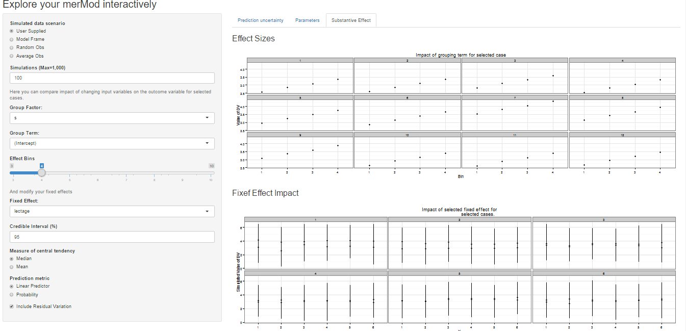
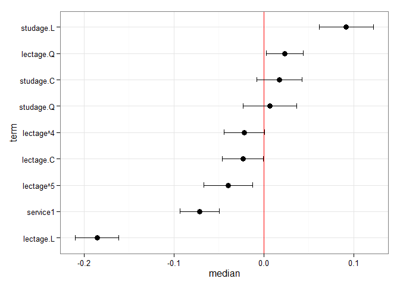
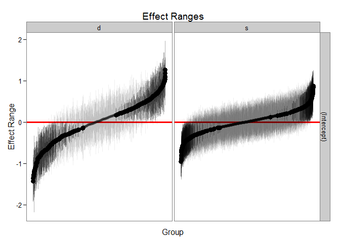
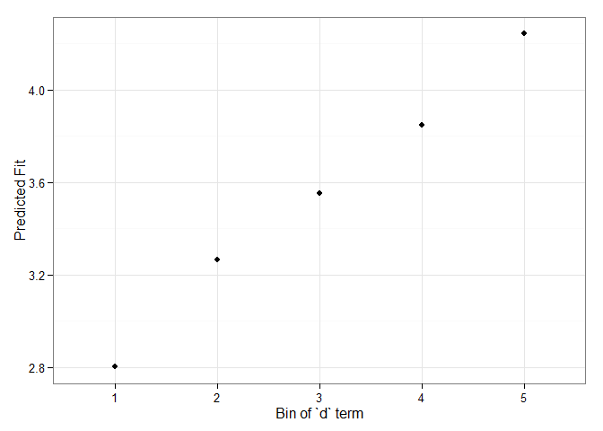

<!-- README.md is generated from README.Rmd. Please edit that file -->
merTools
========

[](https://travis-ci.org/jknowles/merTools) [](https://coveralls.io/r/jknowles/merTools?branch=master)

Working with generalized linear mixed models (GLMM) and linear mixed models (LMM) has become increasingly easy with advances in the `lme4` package. As we have found ourselves using these models more and more within our work, we, the authors, have developed a set of tools for simplifying and speeding up common tasks for interacting with `merMod` objects from `lme4`. This package provides those tools.

Installation
------------

``` r
# development version
library(devtools)
install_github("jknowles/merTools")

# CRAN version -- comin soon
install.packages("merTools")
```

Shiny App and Demo
------------------

The easiest way to demo the features of this application is to use the bundled Shiny application which launches a number of the metrics here to aide in exploring the model. To do this:

``` r
devtools::install_github("jknowles/merTools")
library(merTools)
m1 <- lmer(y ~ service + lectage + studage + (1|d) + (1|s), data=InstEval)
shinyMer(m1, simData = InstEval[1:100, ]) # just try the first 100 rows of data
```


On the first tab, the function presents the prediction intervals for the data selected by user which are calculated using the `predictInterval` function within the package. This function calculates prediction intervals quickly by sampling from the simulated distribution of the fixed effect and random effect terms and combining these simulated estimates to produce a distribution of predictions for each observation. This allows prediction intervals to be generated from very large models where the use of `bootMer` would not be feasible computationally.


On the next tab the distribution of the fixed effect and group-level effects is depicted on confidence interval plots. These are useful for diagnostics and provide a way to inspect the relative magnitudes of various parameters. This tab makes use of four related functions in `merTools`: `FEsim`, `plotFEsim`, `REsim` and `plotREsim` which are available to be used on their own as well.



On the third tab are some convenient ways to show the influence or magnitude of effects by leveraging the power of `predictInterval`. For each case, up to 12, in the selected data type, the user can view the impact of changing either one of the fixed effect or one of the grouping level terms. Using the `REimpact` function, each case is simulated with the model's prediction if all else was held equal, but the observation was moved through the distribution of the fixed effect or the random effect term. This is plotted on the scale of the dependent variable, which allows the user to compare the magnitude of effects across variables, and also between models on the same data.

Predicting
----------

Standard prediction looks like so.

``` r
predict(m1, newdata = InstEval[1:10, ])
#>        1        2        3        4        5        6        7        8 
#> 3.146336 3.165211 3.398499 3.114248 3.320686 3.252670 4.180896 3.845218 
#>        9       10 
#> 3.779336 3.331012
```

With `predictInterval` we obtain predictions that are more like the standard objects produced by `lm` and `glm`:

``` r
#predictInterval(m1, newdata = InstEval[1:10, ]) # all other parameters are optional
predictInterval(m1, newdata = InstEval[1:10, ], n.sims = 500, level = 0.9, 
                stat = 'median')
#>         fit      lwr      upr
#> 1  3.078286 1.100499 5.075946
#> 2  3.281134 1.197379 5.264665
#> 3  3.384164 1.285076 5.387058
#> 4  3.118024 1.117647 5.036167
#> 5  3.377948 1.284856 5.243332
#> 6  3.107704 1.157633 5.184480
#> 7  4.130902 2.299942 6.082705
#> 8  3.813057 1.665037 6.046188
#> 9  3.714768 1.873445 5.713179
#> 10 3.257304 1.384473 5.371605
```

Note that `predictInterval` is slower because it is computing simulations. It can also return all of the simulated `yhat` values as an attribute to the predict object itself.

`predictInterval` uses the `sim` function from the `arm` package heavily to draw the distributions of the parameters of the model. It then combines these simulated values to create a distribution of the `yhat` for each observation.

Plotting
--------

`merTools` also provides functionality for inspecting `merMod` objects visually. The easiest are getting the posterior distributions of both fixed and random effect parameters.

``` r
feSims <- FEsim(m1, n.sims = 100)
head(feSims)
#>          term        mean      median         sd
#> 1 (Intercept)  3.22351474  3.22238125 0.02101745
#> 2    service1 -0.07104383 -0.07155633 0.01208565
#> 3   lectage.L -0.18367262 -0.18578667 0.01700876
#> 4   lectage.Q  0.02251852  0.02184987 0.01194409
#> 5   lectage.C -0.02479466 -0.02519008 0.01338426
#> 6   lectage^4 -0.02038715 -0.02044519 0.01357396
```

And we can also plot this:

``` r
plotFEsim(FEsim(m1, n.sims = 100), level = 0.9, stat = 'median', intercept = FALSE)
```



We can also quickly make caterpillar plots for the random-effect terms:

``` r
reSims <- REsim(m1, n.sims = 100)
head(reSims)
#>   groupFctr groupID        term        mean      median        sd
#> 1         s       1 (Intercept)  0.19821016  0.19214152 0.3250163
#> 2         s       2 (Intercept) -0.06045705 -0.04451279 0.2864522
#> 3         s       3 (Intercept)  0.32596250  0.30733520 0.3302377
#> 4         s       4 (Intercept)  0.19792109  0.21013437 0.2659287
#> 5         s       5 (Intercept)  0.07336024  0.06520529 0.3045121
#> 6         s       6 (Intercept)  0.11970748  0.10135723 0.2374726
```

``` r
plotREsim(REsim(m1, n.sims = 100), stat = 'median', sd = TRUE)
```



Note that `plotREsim` highlights group levels that have a simulated distribution that does not overlap 0 -- these appear darker. The lighter bars represent grouping levels that are not distinguishable from 0 in the data.

Effect Simulation
-----------------

It can still be difficult to interpret the results of LMM and GLMM models, especially the relative influence of varying parameters on the predicted outcome. This is where the `REimpact` and the `wiggle` functions in `merTools` can be handy.

``` r
impSim <- REimpact(m1, InstEval[7, ], groupFctr = "d", breaks = 5, 
                   n.sims = 300, level = 0.9)
impSim
#>   case bin   AvgFit     AvgFitSE nobs
#> 1    1   1 2.801906 2.822563e-04  193
#> 2    1   2 3.262834 6.160406e-05  240
#> 3    1   3 3.552282 5.583509e-05  254
#> 4    1   4 3.846419 6.203321e-05  265
#> 5    1   5 4.241502 1.982743e-04  176
```

The result of `REimpact` shows the change in the `yhat` as the case we supplied to `newdata` is moved from the first to the fifth quintile in terms of the magnitude of the group factor coefficient. We can see here that the individual professor effect has a strong impact on the outcome variable. This can be shown graphically as well:

``` r
library(ggplot2)
ggplot(impSim, aes(x = factor(bin), y = AvgFit, ymin = AvgFit - 1.96*AvgFitSE, 
                   ymax = AvgFit + 1.96*AvgFitSE)) + 
  geom_pointrange() + theme_bw() + labs(x = "Bin of `d` term", y = "Predicted Fit")
```



Here the standard error is a bit different -- it is the weighted standard error of the mean effect within the bin. It does not take into account the variability within the effects of each observation in the bin -- accounting for this variation will be a future addition to `merTools`.
