[](https://cran.r-project.org/package=merTools)
[](https://cran.r-project.org/package=merTools)
[](https://cran.r-project.org/package=merTools)

<!-- README.md is generated from README.Rmd. Please edit that file -->

# merTools

A package for getting the most out of large multilevel models in R

by Jared E. Knowles and Carl Frederick

Working with generalized linear mixed models (GLMM) and linear mixed
models (LMM) has become increasingly easy with advances in the `lme4`
package. As we have found ourselves using these models more and more
within our work, we, the authors, have developed a set of tools for
simplifying and speeding up common tasks for interacting with `merMod`
objects from `lme4`. This package provides those tools.

## Installation

``` r
# development version
library(devtools)
install_github("jknowles/merTools")

# CRAN version
install.packages("merTools")
```

## Recent Updates

### merTools 1.0.0 (May 2026): Long-Term Support release

- This release marks `merTools` as **feature complete**. The package now
  enters **maintenance mode**: future releases will focus on bug fixes,
  dependency and CRAN compatibility, and documentation rather than new
  features.
- It also resolves the last of the open issues: a correctness fix for
  `predictInterval()` on nested random effects (#124), a repaired and
  extended `shinyMer()` (#32, \#78), the new `plotREimpact()` plot (#84,
  \#85), and refreshed documentation (#116, \#136, \#137). See `NEWS.md`
  for the full list.

### merTools 0.6.4 (January 2026)

- Maintenance release to merge @DavisVaughan changes to accommodate
  upstream changes in `vctrs` package impacting `dplyr::bind_rows()`
  usage in `REsim` (#133)

### merTools 0.6.3 (September 2025)

- Maintenance release to fix crossreference issues with function
  documentation

### merTools 0.6.2 (Early 2024)

- Maintenance release to fix minor issues with function documentation
- Fix \#130 by avoiding conflict with `vcov` in the `merDeriv` package
- Upgrade package test infrastructure to 3e testthat specification

### merTools 0.6.1 (Spring 2023)

- Maintenance release to keep package listed on CRAN
- Fix a small bug where parallel code path is run twice (#126)
- Update plotting functions to avoid deprecated `aes_string()` calls
  (#127)
- Fix (#115) in description
- Speed up PI using @bbolker pull request (#120)
- Updated package maintainer contact information

### merTools 0.5.0

#### New Features

- `subBoot` now works with `glmerMod` objects as well
- `reMargins` a new function that allows the user to marginalize the
  prediction over breaks in the distribution of random effect
  distributions, see `?reMargins` and the new `reMargins` vignette
  (closes \#73)

#### Bug fixes

- Fixed an issue where known convergence errors were issuing warnings
  and causing the test suite to not work
- Fixed an issue where models with a random slope, no intercept, and no
  fixed term were unable to be predicted (#101)
- Fixed an issue with shinyMer not working with substantive fixed
  effects (#93)

### merTools 0.4.1

#### New Features

- Standard errors reported by `merModList` functions now apply the Rubin
  correction for multiple imputation

#### Bug fixes

- Contribution by Alex Whitworth (@alexWhitworth) adding error checking
  to plotting functions

## Shiny App and Demo

The easiest way to demo the features of this application is to use the
bundled Shiny application which launches a number of the metrics here to
aide in exploring the model. To do this:

    library(merTools)
    m1 <- lmer(y ~ service + lectage + studage + (1|d) + (1|s), data=InstEval)
    shinyMer(m1, simData = InstEval[1:100, ]) # just try the first 100 rows of data

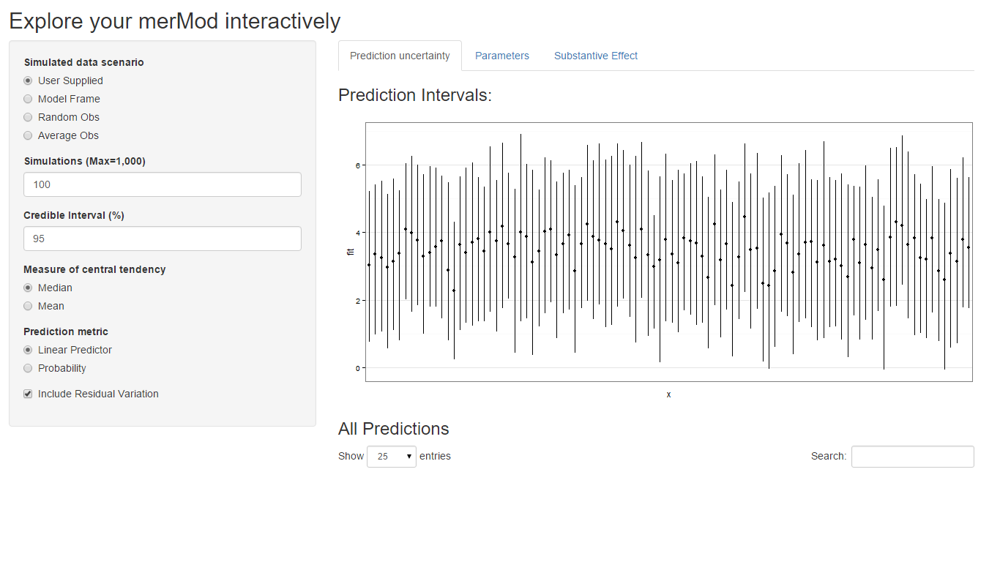

On the first tab, the function presents the prediction intervals for the
data selected by user which are calculated using the `predictInterval`
function within the package. This function calculates prediction
intervals quickly by sampling from the simulated distribution of the
fixed effect and random effect terms and combining these simulated
estimates to produce a distribution of predictions for each observation.
This allows prediction intervals to be generated from very large models
where the use of `bootMer` would not be feasible computationally.

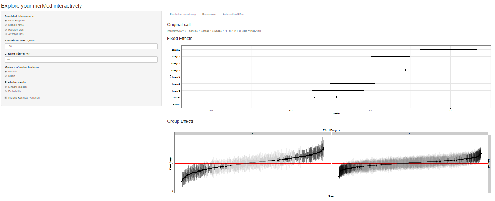

On the next tab the distribution of the fixed effect and group-level
effects is depicted on confidence interval plots. These are useful for
diagnostics and provide a way to inspect the relative magnitudes of
various parameters. This tab makes use of four related functions in
`merTools`: `FEsim`, `plotFEsim`, `REsim` and `plotREsim` which are
available to be used on their own as well.

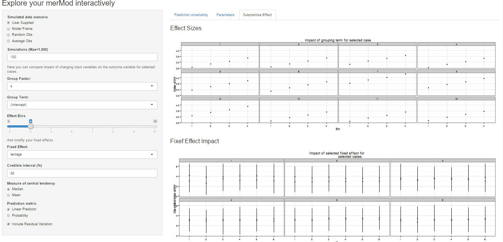

On the third tab are some convenient ways to show the influence or
magnitude of effects by leveraging the power of `predictInterval`. For
each case, up to 12, in the selected data type, the user can view the
impact of changing either one of the fixed effect or one of the grouping
level terms. Using the `REimpact` function, each case is simulated with
the model’s prediction if all else was held equal, but the observation
was moved through the distribution of the fixed effect or the random
effect term. This is plotted on the scale of the dependent variable,
which allows the user to compare the magnitude of effects across
variables, and also between models on the same data.

## Predicting

Standard prediction looks like so.

``` r
predict(m1, newdata = InstEval[1:10, ])
#>        1        2        3        4        5        6        7        8 
#> 3.146337 3.165212 3.398499 3.114249 3.320686 3.252670 4.180897 3.845219 
#>        9       10 
#> 3.779337 3.331013
```

With `predictInterval` we obtain predictions that are more like the
standard objects produced by `lm` and `glm`:

``` r
predictInterval(m1, newdata = InstEval[1:10, ], n.sims = 500, level = 0.9,
                stat = 'median')
#>         fit      upr      lwr
#> 1  3.161371 5.103826 1.139883
#> 2  3.232387 5.009761 1.332832
#> 3  3.445031 5.291794 1.499974
#> 4  3.013080 5.244352 1.104054
#> 5  3.291172 5.228658 1.150961
#> 6  3.311819 5.336952 1.060889
#> 7  4.165035 5.971790 2.084237
#> 8  3.830382 5.578582 1.791503
#> 9  3.801973 5.845741 1.924566
#> 10 3.358777 5.288322 1.581321
```

Note that `predictInterval` is slower because it is computing
simulations. It can also return all of the simulated `yhat` values as an
attribute to the predict object itself.

`predictInterval` uses the `sim` function from the `arm` package heavily
to draw the distributions of the parameters of the model. It then
combines these simulated values to create a distribution of the `yhat`
for each observation.

### Inspecting the Prediction Components

We can also explore the components of the prediction interval by asking
`predictInterval` to return specific components of the prediction
interval.

``` r
predictInterval(m1, newdata = InstEval[1:10, ], n.sims = 200, level = 0.9,
                stat = 'median', which = "all")
#>      effect          fit      upr        lwr obs
#> 1  combined  3.083593245 5.062599  0.9674464   1
#> 2  combined  3.235036697 5.212885  1.1708064   2
#> 3  combined  3.342847853 5.371818  1.2686879   3
#> 4  combined  3.077033326 5.251489  1.3107275   4
#> 5  combined  3.316029839 5.337122  1.4697923   5
#> 6  combined  3.443738022 5.172142  0.9068009   6
#> 7  combined  4.112843798 6.535431  2.1650584   7
#> 8  combined  3.816085776 5.974373  1.8064576   8
#> 9  combined  3.792304602 5.609345  1.8844468   9
#> 10 combined  3.333815423 5.402147  1.5005593  10
#> 11        s  0.231536444 1.790168 -1.7006576   1
#> 12        s  0.134265072 1.957335 -1.7931547   2
#> 13        s  0.218560304 2.021749 -1.7836963   3
#> 14        s -0.099702591 2.029545 -1.8110851   4
#> 15        s -0.045505671 1.693573 -2.1095589   5
#> 16        s -0.087337382 1.716194 -2.0527377   6
#> 17        s  0.376170634 2.109191 -1.8125491   7
#> 18        s  0.364157813 2.329252 -1.4930631   8
#> 19        s  0.415591035 2.240454 -1.4130724   9
#> 20        s  0.356965891 2.283956 -1.7016778  10
#> 21        d  0.008946287 1.700966 -2.0450912   1
#> 22        d -0.095226122 1.741526 -2.0126363   2
#> 23        d -0.171781743 2.068428 -2.2161950   3
#> 24        d -0.225090139 1.962778 -2.2287493   4
#> 25        d  0.242943045 2.185860 -1.5681800   5
#> 26        d -0.083381572 1.958019 -2.1527131   6
#> 27        d  0.505729236 2.272959 -1.0985370   7
#> 28        d  0.223848219 1.892653 -1.4133758   8
#> 29        d  0.232838207 2.161019 -1.6092655   9
#> 30        d -0.411865471 1.744540 -2.4933411  10
#> 31    fixed  3.102540070 5.098888  1.2745417   1
#> 32    fixed  3.071049868 5.045066  1.1160584   2
#> 33    fixed  3.325102518 5.242442  1.1231595   3
#> 34    fixed  3.185105756 4.766187  1.1267020   4
#> 35    fixed  3.392547857 4.902974  1.3989885   5
#> 36    fixed  3.213560141 4.949743  1.2420229   6
#> 37    fixed  3.197190288 5.109854  1.1668196   7
#> 38    fixed  3.305944109 5.132413  1.5010800   8
#> 39    fixed  3.395006368 5.327011  1.7248772   9
#> 40    fixed  3.415382668 5.052743  1.1706732  10
```

This can lead to some useful plotting:

``` r
library(ggplot2)
plotdf <- predictInterval(m1, newdata = InstEval[1:10, ], n.sims = 2000,
                          level = 0.9, stat = 'median', which = "all",
                          include.resid.var = FALSE)
plotdfb <- predictInterval(m1, newdata = InstEval[1:10, ], n.sims = 2000,
                          level = 0.9, stat = 'median', which = "all",
                          include.resid.var = TRUE)

plotdf <- dplyr::bind_rows(plotdf, plotdfb, .id = "residVar")
plotdf$residVar <- ifelse(plotdf$residVar == 1, "No Model Variance",
                          "Model Variance")

ggplot(plotdf, aes(x = obs, y = fit, ymin = lwr, ymax = upr)) +
  geom_pointrange() +
  geom_hline(yintercept = 0, color = I("red"), size = 1.1) +
  scale_x_continuous(breaks = c(1, 10)) +
  facet_grid(residVar~effect) + theme_bw()
#> Warning: Using `size` aesthetic for lines was deprecated in ggplot2 3.4.0.
#> ℹ Please use `linewidth` instead.
#> This warning is displayed once per session.
#> Call `lifecycle::last_lifecycle_warnings()` to see where this warning was
#> generated.
```

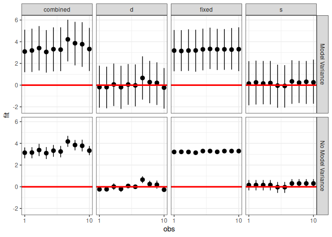<!-- -->

We can also investigate the makeup of the prediction for each
observation.

``` r
ggplot(plotdf[plotdf$obs < 6,],
       aes(x = effect, y = fit, ymin = lwr, ymax = upr)) +
  geom_pointrange() +
  geom_hline(yintercept = 0, color = I("red"), size = 1.1) +
  facet_grid(residVar~obs) + theme_bw()
```

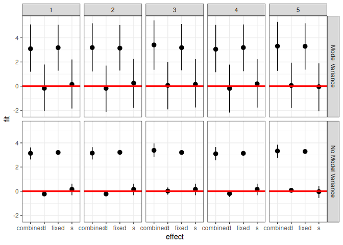<!-- -->

## Plotting

`merTools` also provides functionality for inspecting `merMod` objects
visually. The easiest are getting the posterior distributions of both
fixed and random effect parameters.

``` r
feSims <- FEsim(m1, n.sims = 100)
head(feSims)
#>          term        mean      median         sd
#> 1 (Intercept)  3.22480254  3.22496233 0.01614456
#> 2    service1 -0.06978571 -0.07023666 0.01257453
#> 3   lectage.L -0.18553409 -0.18582412 0.01558176
#> 4   lectage.Q  0.02485585  0.02585718 0.01197095
#> 5   lectage.C -0.02587443 -0.02424027 0.01327372
#> 6   lectage^4 -0.02253842 -0.02115560 0.01434107
```

And we can also plot this:

``` r
plotFEsim(FEsim(m1, n.sims = 100), level = 0.9, stat = 'median', intercept = FALSE)
```

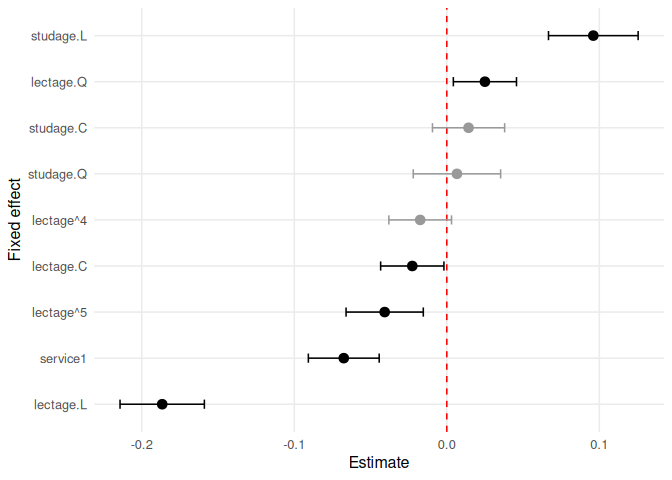<!-- -->

We can also quickly make caterpillar plots for the random-effect terms:

``` r
reSims <- REsim(m1, n.sims = 100)
head(reSims)
#>   groupFctr groupID        term         mean      median        sd
#> 1         s       1 (Intercept)  0.148244481 0.170819888 0.3386784
#> 2         s       2 (Intercept) -0.006549032 0.009520074 0.3202212
#> 3         s       3 (Intercept)  0.264735849 0.268038770 0.2765385
#> 4         s       4 (Intercept)  0.259182685 0.242682150 0.3018633
#> 5         s       5 (Intercept)  0.020047123 0.019007888 0.3068737
#> 6         s       6 (Intercept)  0.081449654 0.078937547 0.2519452
```

``` r
plotREsim(REsim(m1, n.sims = 100), stat = 'median', sd = TRUE)
```

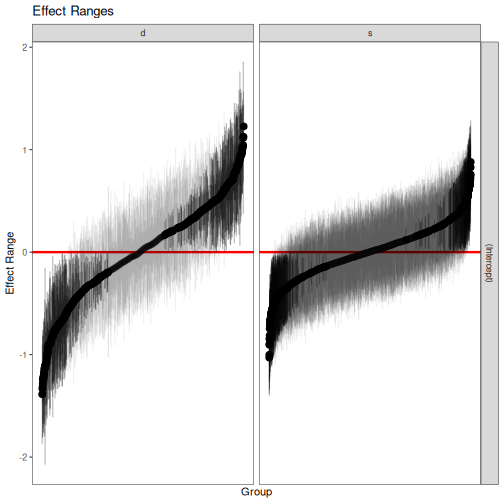<!-- -->

Note that `plotREsim` highlights group levels that have a simulated
distribution that does not overlap 0 – these appear darker. The lighter
bars represent grouping levels that are not distinguishable from 0 in
the data.

Sometimes the random effects can be hard to interpret and not all of
them are meaningfully different from zero. To help with this `merTools`
provides the `expectedRank` function, which provides the percentile
ranks for the observed groups in the random effect distribution taking
into account both the magnitude and uncertainty of the estimated effect
for each group.

``` r
ranks <- expectedRank(m1, groupFctr = "d")
head(ranks)
#>   groupFctr groupLevel      term   estimate  std.error       ER pctER
#> 2         d          1 Intercept  0.3944919 0.08665152 835.3005    74
#> 3         d          6 Intercept -0.4428949 0.03901988 239.5363    21
#> 4         d          7 Intercept  0.6562681 0.03717200 997.3569    88
#> 5         d          8 Intercept -0.6430680 0.02210017 138.3445    12
#> 6         d         12 Intercept  0.1902940 0.04024063 702.3410    62
#> 7         d         13 Intercept  0.2497464 0.03216255 750.0174    66
```

A nice features `expectedRank` is that you can return the expected rank
for all factors simultaneously and use them:

``` r
ranks <- expectedRank(m1)
head(ranks)
#>   groupFctr groupLevel      term    estimate  std.error       ER pctER
#> 2         s          1 Intercept  0.16732800 0.08165665 1931.570    65
#> 3         s          2 Intercept -0.04409538 0.09234250 1368.160    46
#> 4         s          3 Intercept  0.30382219 0.05204082 2309.941    78
#> 5         s          4 Intercept  0.24756175 0.06641699 2151.828    72
#> 6         s          5 Intercept  0.05232329 0.08174130 1627.693    55
#> 7         s          6 Intercept  0.10191653 0.06648394 1772.548    60

ggplot(ranks, aes(x = term, y = estimate)) +
  geom_violin(fill = "gray50") + facet_wrap(~groupFctr) +
  theme_bw()
```

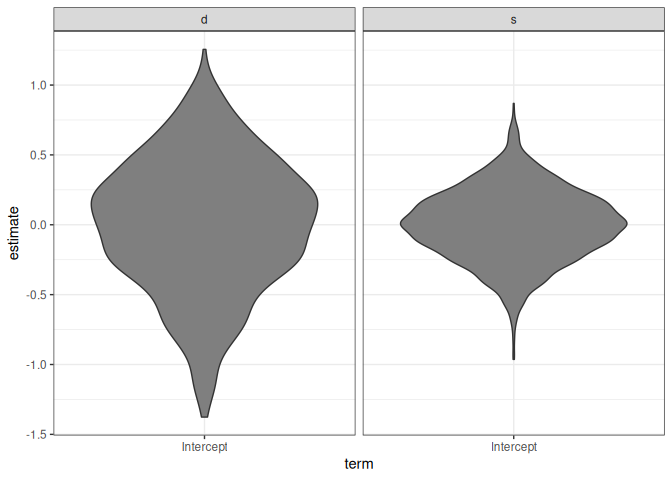<!-- -->

## Effect Simulation

It can still be difficult to interpret the results of LMM and GLMM
models, especially the relative influence of varying parameters on the
predicted outcome. This is where the `REimpact` and the `wiggle`
functions in `merTools` can be handy.

``` r
impSim <- REimpact(m1, InstEval[7, ], groupFctr = "d", breaks = 5,
                   n.sims = 300, level = 0.9)
#> Warning: executing %dopar% sequentially: no parallel backend registered
impSim
#>   case bin   AvgFit     AvgFitSE nobs
#> 1    1   1 2.780092 3.023753e-04  193
#> 2    1   2 3.253589 6.367631e-05  240
#> 3    1   3 3.545126 5.249834e-05  254
#> 4    1   4 3.829405 6.408711e-05  265
#> 5    1   5 4.232709 1.919177e-04  176
```

The result of `REimpact` shows the change in the `yhat` as the case we
supplied to `newdata` is moved from the first to the fifth quintile in
terms of the magnitude of the group factor coefficient. We can see here
that the individual professor effect has a strong impact on the outcome
variable. The new `plotREimpact()` function visualizes this directly:

``` r
plotREimpact(impSim)
```

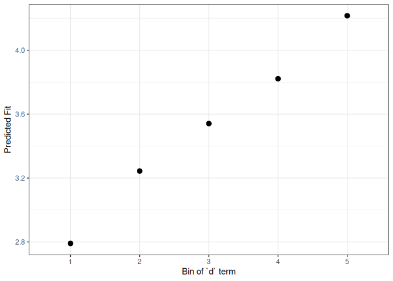<!-- -->

Here the standard error is a bit different – it is the weighted standard
error of the mean effect within the bin. It does not take into account
the variability within the effects of each observation in the bin –
accounting for this variation will be a future addition to `merTools`.
\### Comparing grouping factors with `plotREimpact()`

New in merTools 1.0.0, `plotREimpact()` plots `REimpact()` output
directly and can overlay a *named list* of results on a single chart.
This makes it easy to compare how strongly different grouping factors
move the predicted outcome for the same case – here, the instructor
(`d`) and student (`s`) effects from the model above:

``` r
s_impSim <- REimpact(m1, InstEval[7, ], groupFctr = "s", breaks = 5,
                     n.sims = 300, level = 0.9)
plotREimpact(list("Instructor (d)" = impSim, "Student (s)" = s_impSim))
```

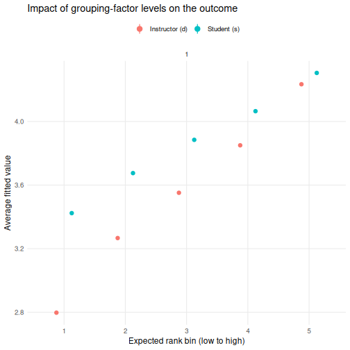<!-- -->

## Explore Substantive Impacts

Another feature of `merTools` is the ability to easily generate
hypothetical scenarios to explore the predicted outcomes of a `merMod`
object and understand what the model is saying in terms of the outcome
variable.

Let’s take the case where we want to explore the impact of a model with
an interaction term between a category and a continuous predictor.
First, we fit a model with interactions:

``` r
data(VerbAgg)
fmVA <- glmer(r2 ~ (Anger + Gender + btype + situ)^2 +
           (1|id) + (1|item), family = binomial,
           data = VerbAgg)
#> Warning in checkConv(attr(opt, "derivs"), opt$par, ctrl = control$checkConv, : Model failed to converge with max|grad| = 0.0729926 (tol = 0.002, component 1)
#>   See ?lme4::convergence and ?lme4::troubleshooting.
```

Now we prep the data using the `draw` function in `merTools`. Here we
draw the average observation from the model frame. We then `wiggle` the
data by expanding the dataframe to include the same observation repeated
but with different values of the variable specified by the `var`
parameter. Here, we expand the dataset to all values of `btype`, `situ`,
and `Anger` subsequently.

``` r
# Select the average case
newData <- draw(fmVA, type = "average")
newData <- wiggle(newData, varlist = "btype",
                  valueslist = list(unique(VerbAgg$btype)))
newData <- wiggle(newData, var = "situ",
                  valueslist = list(unique(VerbAgg$situ)))
newData <- wiggle(newData, var = "Anger",
                  valueslist = list(unique(VerbAgg$Anger)))
head(newData, 10)
#>    r2 Anger Gender btype  situ  id        item
#> 1   N    20      F curse other 149 S3WantCurse
#> 2   N    20      F scold other 149 S3WantCurse
#> 3   N    20      F shout other 149 S3WantCurse
#> 4   N    20      F curse  self 149 S3WantCurse
#> 5   N    20      F scold  self 149 S3WantCurse
#> 6   N    20      F shout  self 149 S3WantCurse
#> 7   N    11      F curse other 149 S3WantCurse
#> 8   N    11      F scold other 149 S3WantCurse
#> 9   N    11      F shout other 149 S3WantCurse
#> 10  N    11      F curse  self 149 S3WantCurse
```

The next step is familiar – we simply pass this new dataset to
`predictInterval` in order to generate predictions for these
counterfactuals. Then we plot the predicted values against the
continuous variable, `Anger`, and facet and group on the two categorical
variables `situ` and `btype` respectively.

``` r
plotdf <- predictInterval(fmVA, newdata = newData, type = "probability",
            stat = "median", n.sims = 1000)
#> Warning: For binomial GLMMs, include.resid.var = TRUE simulates from the
#> conditional binomial distribution (n-trial binomial simulation).
#> This is the theoretically correct approach.
#> To get predictions without residual variance, set include.resid.var = FALSE.
plotdf <- cbind(plotdf, newData)

ggplot(plotdf, aes(y = fit, x = Anger, color = btype, group = btype)) +
  geom_point() + geom_smooth(aes(color = btype), method = "lm") +
  facet_wrap(~situ) + theme_bw() +
  labs(y = "Predicted Probability")
#> `geom_smooth()` using formula = 'y ~ x'
```

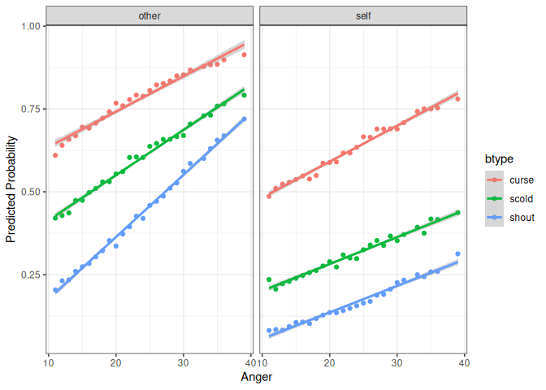<!-- -->

## Cross-version numeric regression checks (for contributors)

`predictInterval()` is stochastic, so the usual unit-test tolerances are
not a reliable way to confirm that a refactor of the simulation
internals has preserved numeric behavior for users who rely on a fixed
seed. To address this, the package ships a standalone regression harness
that pins a canonical set of inputs (LMM and GLMM models, various
`which`, `level`, `stat`, `ignore.fixed.terms`,
`fix.intercept.variance`, and single-row-newdata cases) and dumps
`predictInterval()` output to an RDS bundle for two package versions so
they can be diffed bit-for-bit.

The script lives at `tests/comparisons/predictInterval-regression.R` and
is NOT part of `R CMD check`. It has two modes:

    # Generate an output bundle for one package version
    Rscript tests/comparisons/predictInterval-regression.R harness \
            <pkg_path> <output.rds>

    # Diff two bundles
    Rscript tests/comparisons/predictInterval-regression.R diff \
            <a.rds> <b.rds>

Typical workflow — comparing the current checkout against
`origin/master`:

    git worktree add /tmp/mT-old origin/master
    Rscript tests/comparisons/predictInterval-regression.R harness /tmp/mT-old /tmp/old.rds
    Rscript tests/comparisons/predictInterval-regression.R harness .          /tmp/new.rds
    Rscript tests/comparisons/predictInterval-regression.R diff  /tmp/old.rds /tmp/new.rds
    git worktree remove /tmp/mT-old

The diff output categorizes every case as `IDENTICAL`, `numeric-equal`
(\< 1e-6), or various drift tiers. Any LMM case showing more than
`numeric-equal` indicates that the refactor changed behavior for a
user-supplied seed and should be investigated before the change is
merged. Known-intentional numeric differences (for example, the GLMM
`include.resid.var = TRUE` binomial-residual simulation fix introduced
in 0.9.0) will show up only in the two `glmm_bin_with_resid_*` cases.

Run this whenever touching `R/merPredict.R`,
`R/predictInterval_helpers.R`, or the simulation helpers they call.

## Marginalizing Random Effects

``` r
# get cases
case_idx <- sample(1:nrow(VerbAgg), 10)
mfx <- REmargins(fmVA, newdata = VerbAgg[case_idx,], breaks = 4, groupFctr = "item",
                 type = "probability")
#> Warning: For binomial GLMMs, include.resid.var = TRUE simulates from the
#> conditional binomial distribution (n-trial binomial simulation).
#> This is the theoretically correct approach.
#> To get predictions without residual variance, set include.resid.var = FALSE.

ggplot(mfx, aes(y = fit_combined, x = breaks, group = case)) +
  geom_point() + geom_line() +
  theme_bw() +
  scale_y_continuous(breaks = 1:10/10, limits = c(0, 1)) +
  coord_cartesian(expand = FALSE) +
  labs(x = "Quartile of item random effect Intercept for term 'item'",
       y = "Predicted Probability",
       title = "Simulated Effect of Item Intercept on Predicted Probability for 10 Random Cases")
```

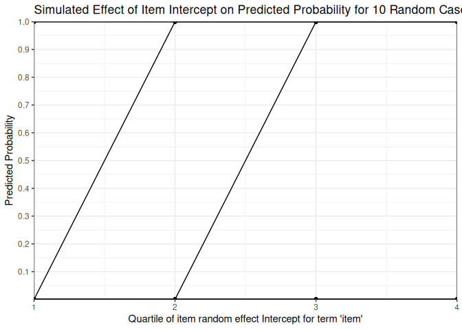<!-- -->
