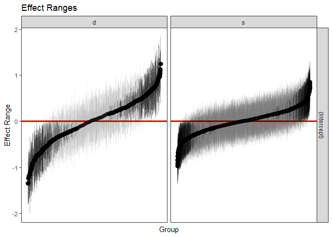

[](https://travis-ci.org/jknowles/merTools)
[](https://coveralls.io/r/jknowles/merTools?branch=master)
[](https://github.com/jknowles/merTools/issues)
[](https://github.com/jknowles/merTools/pulls)
[](https://cran.r-project.org/package=merTools)
[](https://cran.r-project.org/package=merTools)
<https://cranlogs.r-pkg.org/badges/grand-total/merTools> [](http://depsy.org/package/r/merTools)

<!-- README.md is generated from README.Rmd. Please edit that file -->

# merTools

A package for getting the most of our multilevel models in R

by Jared E. Knowles and Carl Frederick

Working with generalized linear mixed models (GLMM) and linear mixed
models (LMM) has become increasingly easy with advances in the `lme4`
package. As we have found ourselves using these models more and more
within our work, we, the authors, have developed a set of tools for
simplifying and speeding up common tasks for interacting with `merMod`
objects from `lme4`. This package provides those tools.

## Installation

``` r
# development version
library(devtools)
install_github("jknowles/merTools")

# CRAN version
install.packages("merTools")
```

## Recent Updates

### merTools 0.4.1

#### New Features

  - Standard errors reported by `merModList` functions now apply the
    Rubin correction for multiple imputation

#### Bug fixes

  - Contribution by Alex Whitworth (@alexWhitworth) adding error
    checking to plotting functions

### merTools 0.4.0

#### New Features

  - Added vignette on using multilevel models with multiply imputed data
  - Added `fixef` and `ranef` generics for `merModList` objects
  - Added `fastdisp` generic for `merModList`
  - Added `summary` generic for `merModList`
  - Added `print` generic for `merModList`
  - Documented all generics for `merModList` including examples and a
    new imputation vignette
  - Added `modelInfo` generic for `merMod` objects that provides simple
    summary stats about a whole model

#### Bug Fixes

  - Fix bug that returned NaN for `std.error` of a multiply imputed
    `merModList` when calling `modelRandEffStats`
  - Fixed bug in `REimpact` where some column names in `newdata` would
    prevent the prediction intervals from being computed correctly.
    Users will now be warned.
  - Fixed bug in `wiggle` where documentation incorrectly stated the
    arguments to the function and the documentation did not describe
    function correctly

See [NEWS.md](https://github.com/jknowles/merTools/blob/master/NEWS.md)
for more details.

## Shiny App and Demo

The easiest way to demo the features of this application is to use the
bundled Shiny application which launches a number of the metrics here to
aide in exploring the model. To do this:

``` r
library(merTools)
m1 <- lmer(y ~ service + lectage + studage + (1|d) + (1|s), data=InstEval)
shinyMer(m1, simData = InstEval[1:100, ]) # just try the first 100 rows of data
```


On the first tab, the function presents the prediction intervals for the
data selected by user which are calculated using the `predictInterval`
function within the package. This function calculates prediction
intervals quickly by sampling from the simulated distribution of the
fixed effect and random effect terms and combining these simulated
estimates to produce a distribution of predictions for each observation.
This allows prediction intervals to be generated from very large models
where the use of `bootMer` would not be feasible computationally.


On the next tab the distribution of the fixed effect and group-level
effects is depicted on confidence interval plots. These are useful for
diagnostics and provide a way to inspect the relative magnitudes of
various parameters. This tab makes use of four related functions in
`merTools`: `FEsim`, `plotFEsim`, `REsim` and `plotREsim` which are
available to be used on their own as well.


On the third tab are some convenient ways to show the influence or
magnitude of effects by leveraging the power of `predictInterval`. For
each case, up to 12, in the selected data type, the user can view the
impact of changing either one of the fixed effect or one of the grouping
level terms. Using the `REimpact` function, each case is simulated with
the model’s prediction if all else was held equal, but the observation
was moved through the distribution of the fixed effect or the random
effect term. This is plotted on the scale of the dependent variable,
which allows the user to compare the magnitude of effects across
variables, and also between models on the same data.

## Predicting

Standard prediction looks like so.

``` r
predict(m1, newdata = InstEval[1:10, ])
#>        1        2        3        4        5        6        7        8 
#> 3.146336 3.165211 3.398499 3.114248 3.320686 3.252670 4.180896 3.845218 
#>        9       10 
#> 3.779336 3.331012
```

With `predictInterval` we obtain predictions that are more like the
standard objects produced by `lm` and
`glm`:

``` r
#predictInterval(m1, newdata = InstEval[1:10, ]) # all other parameters are optional
predictInterval(m1, newdata = InstEval[1:10, ], n.sims = 500, level = 0.9, 
                stat = 'median')
#>         fit      upr       lwr
#> 1  3.228134 5.185694 1.0159918
#> 2  3.072357 5.158846 1.2301763
#> 3  3.343040 5.533148 1.3992554
#> 4  3.102235 5.030169 0.9379611
#> 5  3.138072 5.292995 1.4315204
#> 6  3.134039 5.179843 1.0842003
#> 7  4.217092 6.246719 2.3830875
#> 8  3.698182 5.664988 1.8109667
#> 9  3.836403 5.800780 1.7064932
#> 10 3.325114 5.293382 1.4322462
```

Note that `predictInterval` is slower because it is computing
simulations. It can also return all of the simulated `yhat` values as an
attribute to the predict object itself.

`predictInterval` uses the `sim` function from the `arm` package heavily
to draw the distributions of the parameters of the model. It then
combines these simulated values to create a distribution of the `yhat`
for each observation.

### Inspecting the Prediction Components

We can also explore the components of the prediction interval by asking
`predictInterval` to return specific components of the prediction
interval.

``` r
predictInterval(m1, newdata = InstEval[1:10, ], n.sims = 200, level = 0.9, 
                stat = 'median', which = "all")
#>      effect          fit      upr       lwr obs
#> 1  combined  3.017337597 5.088024  1.024675   1
#> 2  combined  3.228086300 5.120228  1.358134   2
#> 3  combined  3.324246517 5.271679  1.494965   3
#> 4  combined  3.080904426 5.203921  1.335800   4
#> 5  combined  3.455020453 5.255384  1.791524   5
#> 6  combined  3.362408634 5.333071  1.337383   6
#> 7  combined  4.062680211 6.075195  2.249946   7
#> 8  combined  3.741245572 5.636748  1.900005   8
#> 9  combined  3.744926075 5.750071  1.965396   9
#> 10 combined  3.322611479 5.290863  1.293424  10
#> 11        s  0.346816992 2.520135 -1.949796   1
#> 12        s  0.235268042 2.169141 -1.515011   2
#> 13        s  0.189859225 2.211509 -1.647229   3
#> 14        s  0.149037477 1.915774 -1.542856   4
#> 15        s  0.015144457 1.718275 -2.051475   5
#> 16        s -0.036161352 1.840863 -2.028481   6
#> 17        s  0.325294783 2.180777 -1.580737   7
#> 18        s  0.309113196 1.957690 -1.624536   8
#> 19        s  0.361351145 1.988621 -1.606489   9
#> 20        s  0.336967092 2.284692 -1.432369  10
#> 21        d -0.228257150 1.743273 -2.069172   1
#> 22        d -0.004238389 1.729515 -1.747685   2
#> 23        d -0.021712554 2.091915 -2.118753   3
#> 24        d -0.167673934 1.733865 -2.253262   4
#> 25        d  0.092775221 1.788870 -1.811353   5
#> 26        d  0.119258232 1.933844 -1.880734   6
#> 27        d  0.877964479 2.272196 -0.993148   7
#> 28        d  0.149934195 2.220833 -1.626118   8
#> 29        d  0.026511469 2.025732 -1.661577   9
#> 30        d -0.323192852 1.716854 -2.160615  10
#> 31    fixed  3.106300528 5.007124  1.182941   1
#> 32    fixed  3.287768191 5.076319  1.530694   2
#> 33    fixed  3.333243653 5.061887  1.557717   3
#> 34    fixed  3.175918917 4.767824  1.258340   4
#> 35    fixed  3.440728856 5.260298  1.628944   5
#> 36    fixed  3.267695980 5.016296  1.534028   6
#> 37    fixed  3.166493821 5.063095  1.204425   7
#> 38    fixed  3.253947246 5.202220  1.468126   8
#> 39    fixed  3.334121205 5.147137  1.489619   9
#> 40    fixed  3.133976129 5.181007  1.285953  10
```

This can lead to some useful plotting:

``` r
library(ggplot2)
plotdf <- predictInterval(m1, newdata = InstEval[1:10, ], n.sims = 2000, 
                          level = 0.9, stat = 'median', which = "all", 
                          include.resid.var = FALSE)
plotdfb <- predictInterval(m1, newdata = InstEval[1:10, ], n.sims = 2000, 
                          level = 0.9, stat = 'median', which = "all", 
                          include.resid.var = TRUE)

plotdf <- bind_rows(plotdf, plotdfb, .id = "residVar")
plotdf$residVar <- ifelse(plotdf$residVar == 1, "No Model Variance", 
                          "Model Variance")

ggplot(plotdf, aes(x = obs, y = fit, ymin = lwr, ymax = upr)) + 
  geom_pointrange() +
  geom_hline(yintercept = 0, color = I("red"), size = 1.1) +
  scale_x_continuous(breaks = c(1, 10)) +
  facet_grid(residVar~effect) + theme_bw()
```

<!-- -->

We can also investigate the makeup of the prediction for each
observation.

``` r
ggplot(plotdf[plotdf$obs < 6,], 
       aes(x = effect, y = fit, ymin = lwr, ymax = upr)) + 
  geom_pointrange() +
  geom_hline(yintercept = 0, color = I("red"), size = 1.1) +
  facet_grid(residVar~obs) + theme_bw()
```

<!-- -->

## Plotting

`merTools` also provides functionality for inspecting `merMod` objects
visually. The easiest are getting the posterior distributions of both
fixed and random effect parameters.

``` r
feSims <- FEsim(m1, n.sims = 100)
head(feSims)
#>          term        mean      median         sd
#> 1 (Intercept)  3.22372478  3.22402139 0.01993324
#> 2    service1 -0.06995190 -0.07088853 0.01375080
#> 3   lectage.L -0.18447576 -0.18404096 0.01527631
#> 4   lectage.Q  0.02396921  0.02483603 0.01375510
#> 5   lectage.C -0.02272901 -0.02457700 0.01303510
#> 6   lectage^4 -0.02022400 -0.01999282 0.01258985
```

And we can also plot
this:

``` r
plotFEsim(FEsim(m1, n.sims = 100), level = 0.9, stat = 'median', intercept = FALSE)
```

<!-- -->

We can also quickly make caterpillar plots for the random-effect terms:

``` r
reSims <- REsim(m1, n.sims = 100)
head(reSims)
#>   groupFctr groupID        term         mean      median        sd
#> 1         s       1 (Intercept)  0.156696049  0.16667284 0.3378410
#> 2         s       2 (Intercept) -0.064746410 -0.04483635 0.2977927
#> 3         s       3 (Intercept)  0.300071420  0.29962286 0.2640250
#> 4         s       4 (Intercept)  0.229157548  0.23848022 0.2658498
#> 5         s       5 (Intercept) -0.005303968 -0.01841906 0.2876036
#> 6         s       6 (Intercept)  0.034281375  0.05637082 0.2502556
```

``` r
plotREsim(REsim(m1, n.sims = 100), stat = 'median', sd = TRUE)
```

<!-- -->

Note that `plotREsim` highlights group levels that have a simulated
distribution that does not overlap 0 – these appear darker. The lighter
bars represent grouping levels that are not distinguishable from 0 in
the data.

Sometimes the random effects can be hard to interpret and not all of
them are meaningfully different from zero. To help with this `merTools`
provides the `expectedRank` function, which provides the percentile
ranks for the observed groups in the random effect distribution taking
into account both the magnitude and uncertainty of the estimated effect
for each group.

``` r
ranks <- expectedRank(m1, groupFctr = "d")
head(ranks)
#>   groupFctr groupLevel       term   estimate  std.error       ER pctER
#> 2         d          1 _Intercept  0.3944916 0.08665149 835.3004    74
#> 3         d          6 _Intercept -0.4428947 0.03901987 239.5364    21
#> 4         d          7 _Intercept  0.6562683 0.03717200 997.3570    88
#> 5         d          8 _Intercept -0.6430679 0.02210017 138.3445    12
#> 6         d         12 _Intercept  0.1902942 0.04024063 702.3412    62
#> 7         d         13 _Intercept  0.2497467 0.03216254 750.0176    66
```

A nice features `expectedRank` is that you can return the expected rank
for all factors simultaneously and use them:

``` r
ranks <- expectedRank(m1)
head(ranks)
#>   groupFctr groupLevel       term    estimate  std.error       ER pctER
#> 2         s          1 _Intercept  0.16732725 0.08165631 1931.569    65
#> 3         s          2 _Intercept -0.04409515 0.09234206 1368.161    46
#> 4         s          3 _Intercept  0.30382125 0.05204068 2309.940    78
#> 5         s          4 _Intercept  0.24756083 0.06641676 2151.827    72
#> 6         s          5 _Intercept  0.05232309 0.08174095 1627.693    55
#> 7         s          6 _Intercept  0.10191622 0.06648371 1772.548    60

ggplot(ranks, aes(x = term, y = estimate)) + 
  geom_violin(fill = "gray50") + facet_wrap(~groupFctr) +
  theme_bw()
```

<!-- -->

## Effect Simulation

It can still be difficult to interpret the results of LMM and GLMM
models, especially the relative influence of varying parameters on the
predicted outcome. This is where the `REimpact` and the `wiggle`
functions in `merTools` can be handy.

``` r
impSim <- REimpact(m1, InstEval[7, ], groupFctr = "d", breaks = 5, 
                   n.sims = 300, level = 0.9)
#> Warning: executing %dopar% sequentially: no parallel backend registered
impSim
#>   case bin   AvgFit     AvgFitSE nobs
#> 1    1   1 2.782701 3.005778e-04  193
#> 2    1   2 3.252176 6.491203e-05  240
#> 3    1   3 3.554695 5.452947e-05  254
#> 4    1   4 3.844761 6.082597e-05  265
#> 5    1   5 4.215359 1.934479e-04  176
```

The result of `REimpact` shows the change in the `yhat` as the case we
supplied to `newdata` is moved from the first to the fifth quintile in
terms of the magnitude of the group factor coefficient. We can see here
that the individual professor effect has a strong impact on the outcome
variable. This can be shown graphically as
well:

``` r
ggplot(impSim, aes(x = factor(bin), y = AvgFit, ymin = AvgFit - 1.96*AvgFitSE, 
                   ymax = AvgFit + 1.96*AvgFitSE)) + 
  geom_pointrange() + theme_bw() + labs(x = "Bin of `d` term", y = "Predicted Fit")
```

<!-- -->

Here the standard error is a bit different – it is the weighted standard
error of the mean effect within the bin. It does not take into account
the variability within the effects of each observation in the bin –
accounting for this variation will be a future addition to `merTools`.

## Explore Substantive Impacts

Another feature of `merTools` is the ability to easily generate
hypothetical scenarios to explore the predicted outcomes of a `merMod`
object and understand what the model is saying in terms of the outcome
variable.

Let’s take the case where we want to explore the impact of a model with
an interaction term between a category and a continuous predictor.
First, we fit a model with interactions:

``` r
data(VerbAgg)
fmVA <- glmer(r2 ~ (Anger + Gender + btype + situ)^2 +
           (1|id) + (1|item), family = binomial, 
           data = VerbAgg)
#> Warning in checkConv(attr(opt, "derivs"), opt$par, ctrl = control
#> $checkConv, : Model failed to converge with max|grad| = 0.0505464 (tol =
#> 0.001, component 1)
```

Now we prep the data using the `draw` function in `merTools`. Here we
draw the average observation from the model frame. We then `wiggle` the
data by expanding the dataframe to include the same observation repeated
but with different values of the variable specified by the `var`
parameter. Here, we expand the dataset to all values of `btype`, `situ`,
and `Anger` subsequently.

``` r
# Select the average case
newData <- draw(fmVA, type = "average")
newData <- wiggle(newData, varlist = "btype", 
                  valueslist = list(unique(VerbAgg$btype)))
newData <- wiggle(newData, var = "situ", 
                  valueslist = list(unique(VerbAgg$situ)))
newData <- wiggle(newData, var = "Anger", 
                  valueslist = list(unique(VerbAgg$Anger)))
head(newData, 10)
#>    r2 Anger Gender btype  situ  id        item
#> 1   N    20      F curse other 149 S3WantCurse
#> 2   N    20      F scold other 149 S3WantCurse
#> 3   N    20      F shout other 149 S3WantCurse
#> 4   N    20      F curse  self 149 S3WantCurse
#> 5   N    20      F scold  self 149 S3WantCurse
#> 6   N    20      F shout  self 149 S3WantCurse
#> 7   N    11      F curse other 149 S3WantCurse
#> 8   N    11      F scold other 149 S3WantCurse
#> 9   N    11      F shout other 149 S3WantCurse
#> 10  N    11      F curse  self 149 S3WantCurse
```

The next step is familiar – we simply pass this new dataset to
`predictInterval` in order to generate predictions for these
counterfactuals. Then we plot the predicted values against the
continuous variable, `Anger`, and facet and group on the two categorical
variables `situ` and `btype`
respectively.

``` r
plotdf <- predictInterval(fmVA, newdata = newData, type = "probability", 
            stat = "median", n.sims = 1000)
plotdf <- cbind(plotdf, newData)

ggplot(plotdf, aes(y = fit, x = Anger, color = btype, group = btype)) + 
  geom_point() + geom_smooth(aes(color = btype), method = "lm") + 
  facet_wrap(~situ) + theme_bw() +
  labs(y = "Predicted Probability")
```

<!-- -->
