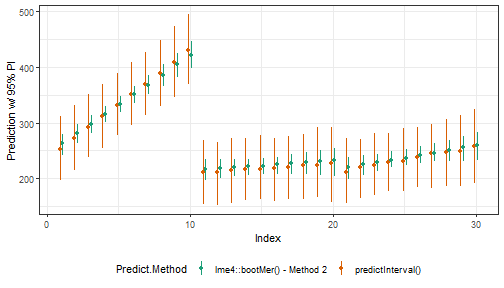

## Introduction

Fitting (generalized) linear mixed models, (G)LMM, to very large data sets is
becoming increasingly easy, but understanding and communicating the uncertainty
inherent in those models is not. As the documentation for
`lme4::predict.merMod()` notes:

> There is no option for computing standard errors of predictions because it is
> difficult to define an efficient method that incorporates uncertainty in the
> variance parameters; we recommend `lme4::bootMer()` for this task.

We agree that, short of a fully Bayesian analysis, bootstrapping is the
gold-standard for deriving a prediction interval predictions from a (G)LMM, but
the time required to obtain even a respectable number of replications from
`bootMer()` quickly becomes prohibitive when the initial model fit is on the
order of hours instead of seconds. The only other alternative we have identified
for these situations is to use the `arm::sim()` function to simulate values.
Unfortunately, this only takes variation of the fixed coefficients and residuals
into account, and assumes the conditional modes of the random effects are fixed.

We developed the `predictInterval()` function to incorporate the variation in
the conditional modes of the random effects (CMRE, a.k.a. BLUPs in the LMM case)
into calculating prediction intervals. Ignoring the variance in the CMRE results
in overly confident estimates of predicted values and in cases where the precision
of the grouping term varies across levels of grouping terms, creates the illusion
of difference where none may exist. The importance of accounting for this variance
comes into play sharply when comparing the predictions of different models across
observations.

We take the warning from `lme4::predict.merMod()`
seriously, but view this method as a decent first approximation the full bootstrap
analysis for (G)LMMs fit to very large data sets.

## Conceptual description

In order to generate a proper prediction interval, a prediction must account for
three sources of uncertainty in mixed models:

1. the residual (observation-level) variance,
2. the uncertainty in the fixed coefficients, and
3. the uncertainty in the variance parameters for the grouping factors.

A fourth, uncertainty about the data, is beyond the scope of any prediction method.

As we mentioned above, the `arm:sim()` function incorporates the first two sources
of variation but not the third , while bootstrapping using `lme4::bootMer()`
does incorporate all three sources of uncertainty because it re-estimates the
model using random samples of the data.

When inference about the values of the CMREs is of interest, it would be nice to
incorporate some degree of uncertainty in those estimates when comparing
observations across groups. `predictInterval()` does this by drawing values of
the CMREs from the conditional variance-covariance matrix of the random affects
accessible from `lme4::ranef(model, condVar=TRUE)`. Thus, `predictInterval()`
incorporates all of the uncertainty from sources one and two, and part of the
variance from source 3, but the variance parameters themselves are treated as
fixed.

To do this, `predictInterval()` takes an estimated model of class `merMod` and,
like `predict()`, a data.frame upon which to make those predictions and:

1. extracts the fixed and random coefficients
2. takes `n` draws from the multivariate normal distribution of the fixed and
random coefficients (separately)
3. calculates the linear predictor for each row in `newdata` based on these draws,
and
4. optionally incorporates the residual variation (per the `arm::sim()` function),
and,
5. returns newdata with the lower and upper limits of the prediction interval
and the mean or median of the simulated predictions

Currently, the supported model types are linear mixed models and mixed logistic
regression models.  

The prediction data set *can* include levels that are not in the estimation model
frame. The prediction intervals for such observations only incorporate
uncertainty from fixed coefficient estimates and the residual level of variation.

## Comparison to existing methods

What do the differences between `predictInterval()` and the other methods for
constructing prediction intervals mean in practice? We would expect to see
`predictInterval()` to produce prediction intervals that are wider than all methods
except for the `bootMer()` method. We would also hope that the prediction point
estimate from other methods falls within the prediction interval produced by
`predictInterval()`. Ideally, the predicted point estimate produced by
`predictInterval()`  would fall close to that produced by `bootMer()`.

This section compares the results of `predictInterval()` with those obtained
using `arm::sim()` and `lme4::bootMer()` using the sleepstudy data from
`lme4`.  These data contain reaction time observations for 10 days on 18 subjects.  
The data are sorted such that the first 10 observations are days one through
ten for subject 1, the next 10 are days one through ten for subject 2 and so on.
The example model that we are estimating below estimates random intercepts and a
random slope for the number of days.

###Step 1: Estimating the model and using `predictInterval()`

First, we will load the required packages and data and estimate the model:


```r
set.seed(271828)
data(sleepstudy)
fm1 <- lmer(Reaction ~ Days + (Days|Subject), data=sleepstudy)
display(fm1)
#> lmer(formula = Reaction ~ Days + (Days | Subject), data = sleepstudy)
#>             coef.est coef.se
#> (Intercept) 251.41     6.82 
#> Days         10.47     1.55 
#> 
#> Error terms:
#>  Groups   Name        Std.Dev. Corr 
#>  Subject  (Intercept) 24.74         
#>           Days         5.92    0.07 
#>  Residual             25.59         
#> ---
#> number of obs: 180, groups: Subject, 18
#> AIC = 1755.6, DIC = 1760.3
#> deviance = 1751.9
```

Then, calculate prediction intervals using `predictInterval()`. The `predictInterval`
function has a number of user configurable options. In this example, we use the
original data `sleepstudy` as the newdata. We pass the function the `fm1` model
we fit above. We also choose a 95% interval with `level = 0.95`, though
we could choose a less conservative prediction interval. We make 1,000 simulations
for each observation `n.sims = 1000`. We set the point estimate to be the median
of the simulated values, instead of the mean. We ask for the linear predictor back,
if we fit a logistic regression, we could have asked instead for our predictions
on the probability scale instead. Finally, we indicate that we want the predictions
to incorporate the residual variance from the model -- an option only available
for `lmerMod` objects.


```r
PI.time <- system.time(
  PI <- predictInterval(merMod = fm1, newdata = sleepstudy,
                        level = 0.95, n.sims = 1000,
                        stat = "median", type="linear.prediction",
                        include.resid.var = TRUE)
)
```

Here is the first few rows of the object `PI`:


|      fit|      upr|      lwr|
|--------:|--------:|--------:|
| 251.6685| 311.3171| 196.4096|
| 271.4802| 330.9195| 214.2175|
| 292.6809| 350.9867| 237.7714|
| 311.6967| 369.2911| 254.2237|
| 331.8318| 389.7439| 278.1857|
| 350.7450| 408.1386| 294.8506|

The three columns are the median (`fit`) and limits of the 95% prediction
interval (`upr` and `lwr`) because we set `level=0.95`. The following figure
displays the output graphically for the first 30 observations.


```r
library(ggplot2);
ggplot(aes(x=1:30, y=fit, ymin=lwr, ymax=upr), data=PI[1:30,]) +
  geom_point() +
  geom_linerange() +
  labs(x="Index", y="Prediction w/ 95% PI") + theme_bw()
```


#### Step 1a: Adjusting for correlation between fixed and random effects

The prediction intervals above do not correct for correlations between fixed
and random effects. This tends to lead to predictive intervals that are too
conservative, especially for existing groups when there is a lot of data on
relatively few groups. In that case, a significant portion of the uncertainty
in the prediction can be due to variance in the fixed intercept which is
anti-correlated with variance in the random intercept effects. For instance,
it does not actually matter if the fixed intercept is 5 and the random
intercept effects are -2, 1, and 1, versus a fixed intercept of 6 and
random intercept effects of -3, 0, and 0. (The latter situation will never be
the MLE, but it can occur in this package's simulations.)

To show this issue, we'll use the sleep study model, predicting the reaction times 
of subjects after experiencing sleep deprivation:


```r
fm1 <- lmer(Reaction ~ Days + (Days|Subject), data=sleepstudy)
display(fm1)
#> lmer(formula = Reaction ~ Days + (Days | Subject), data = sleepstudy)
#>             coef.est coef.se
#> (Intercept) 251.41     6.82 
#> Days         10.47     1.55 
#> 
#> Error terms:
#>  Groups   Name        Std.Dev. Corr 
#>  Subject  (Intercept) 24.74         
#>           Days         5.92    0.07 
#>  Residual             25.59         
#> ---
#> number of obs: 180, groups: Subject, 18
#> AIC = 1755.6, DIC = 1760.3
#> deviance = 1751.9
```

Let's use the model to give an interval for the true average body fat of a
large group of students like the first one in the study — a 196cm female
baseball player:


```r
sleepstudy[1,]
#>   Reaction Days Subject
#> 1   249.56    0     308
predictInterval(fm1, sleepstudy[1,], include.resid.var=0) #predict the average body fat for a group of 196cm female baseball players
#>        fit      upr      lwr
#> 1 253.9977 270.7438 236.2829
```

There are two ways to get predictInterval to create less-conservative intervals
to deal with this. The first is just to tell it to consider certain fixed
effects as fully-known (that is, with an effectively 0 variance.) This is done
using the `ignore.fixed.effects` argument.


```r
predictInterval(fm1, sleepstudy[1,], include.resid.var=0, ignore.fixed.terms = 1) 
#>        fit      upr      lwr
#> 1 253.8537 268.5299 239.6275
# predict the average reaction time for a subject at day 0, taking the global intercept 
# (mean reaction time) as fully known
predictInterval(fm1, sleepstudy[1,], include.resid.var=0, ignore.fixed.terms = "(Intercept)") 
#>        fit      upr      lwr
#> 1 254.2354 269.3875 239.3116
#Same as above
predictInterval(fm1, sleepstudy[1,], include.resid.var=0, ignore.fixed.terms = 1:2) 
#>        fit      upr     lwr
#> 1 253.6743 269.8776 237.984
# as above, taking the first two fixed effects (intercept and days effect) as fully known
```

The second way is to use an ad-hoc variance adjustment, with the
`fix.intercept.variance` argument. This takes the model's intercept variance
$\hat\sigma^2_\mu$ and adjusts it to:

$$\hat\sigma\prime^2_\mu = \hat\sigma^2_\mu-\Sigma_{levels}\frac{1}{\Sigma_{groups(level)}1/(\hat\sigma^2_{level}+sigma^2_{group})}$$

In other words, it assumes the given intercept variance incorporates spurious
variance for each level, where each of the spurious variance terms has a
precision equal to the of the precisions due to the individual groups at that
level.


```r
predictInterval(fm1, sleepstudy[1,], include.resid.var=0, 
                fix.intercept.variance = TRUE) 
#>        fit      upr      lwr
#> 1 253.5872 268.8683 236.6639
# predict the average reaction time for a subject at day 0,, using an ad-hoc 
# correction for the covariance of the intercept with the random intercept effects.
```

A few notes about these two arguments:

* `fix.intercept.variance=T` is redundant with `ignore.fixed.effects=1`, but not
vice versa.
* These corrections should NOT be used when predicting outcomes for groups not
present in the original data.

### Step 2: Comparison with `arm::sim()`

How does the output above compare to what we could get from `arm::sim()`?


```r
PI.arm.time <- system.time(
  PI.arm.sims <- arm::sim(fm1, 1000)
)

PI.arm <- data.frame(
  fit=apply(fitted(PI.arm.sims, fm1), 1, function(x) quantile(x, 0.500)),
  upr=apply(fitted(PI.arm.sims, fm1), 1, function(x) quantile(x, 0.975)),
  lwr=apply(fitted(PI.arm.sims, fm1), 1, function(x) quantile(x, 0.025))
)

comp.data <- rbind(data.frame(Predict.Method="predictInterval()", x=(1:nrow(PI))-0.1, PI),
                   data.frame(Predict.Method="arm::sim()", x=(1:nrow(PI.arm))+0.1, PI.arm))

ggplot(aes(x=x, y=fit, ymin=lwr, ymax=upr, color=Predict.Method), data=comp.data[c(1:30,181:210),]) +
  geom_point() +
  geom_linerange() +
  labs(x="Index", y="Prediction w/ 95% PI") +
  theme_bw() +  theme(legend.position="bottom") +
  scale_color_brewer(type = "qual", palette = 2)
```


The prediction intervals from `arm:sim()` are much smaller and the random slope
for days vary more than they do for `predictInterval`. Both results are as
expected, given the small number of subjects and observations per subject in
these data. Because `predictInterval()` is incorporating uncertainty in the CMFEs
(but not the variance parameters of the random coefficients themselves), the
Days slopes are closer to the overall or pooled regression slope.  

###Step 3: Comparison with `lme4::bootMer()`

As quoted above, the developers of lme4 suggest that users interested in
uncertainty estimates around their predictions use `lme4::bootmer()` to calculate
them. The documentation for `lme4::bootMer()` goes on to describe three
implemented flavors of bootstrapped estimates:

1. parametrically resampling both the *"spherical"* random effects
*u* and the i.i.d. errors $\epsilon$
2. treating the random effects as fixed and parametrically resampling the
i.i.d. errors
3. treating the random effects as fixed and semi-parametrically resampling
the i.i.d. errors from the distribution of residuals.

We will compare the results from `predictInterval()` with each method, in turn.

#### Step 3a: `lme4::bootMer()` method 1


```r
##Functions for bootMer() and objects
####Return predicted values from bootstrap
mySumm <- function(.) {
  predict(., newdata=sleepstudy, re.form=NULL)
}
####Collapse bootstrap into median, 95% PI
sumBoot <- function(merBoot) {
  return(
    data.frame(fit = apply(merBoot$t, 2, function(x) as.numeric(quantile(x, probs=.5, na.rm=TRUE))),
               lwr = apply(merBoot$t, 2, function(x) as.numeric(quantile(x, probs=.025, na.rm=TRUE))),
               upr = apply(merBoot$t, 2, function(x) as.numeric(quantile(x, probs=.975, na.rm=TRUE)))
    )
  )
}

##lme4::bootMer() method 1
PI.boot1.time <- system.time(
  boot1 <- lme4::bootMer(fm1, mySumm, nsim=250, use.u=FALSE, type="parametric")
)

PI.boot1 <- sumBoot(boot1)

comp.data <- rbind(data.frame(Predict.Method="predictInterval()", x=(1:nrow(PI))-0.1, PI),
                   data.frame(Predict.Method="lme4::bootMer() - Method 1", x=(1:nrow(PI.boot1))+0.1, PI.boot1))

ggplot(aes(x=x, y=fit, ymin=lwr, ymax=upr, color=Predict.Method), data=comp.data[c(1:30,181:210),]) +
  geom_point() +
  geom_linerange() +
  labs(x="Index", y="Prediction w/ 95% PI") +
  theme_bw() +  theme(legend.position="bottom") +
  scale_color_brewer(type = "qual", palette = 2)
```


The intervals produced by `predictInterval`, represented in green, cover the
point estimates produced by `bootMer` in every case for these 30 observations.
Additionally, in almost every case, the `predictInterval` encompasses the entire
interval presented by `bootMer`. Here, the estimates produced by `bootMer` are
re-estimating the group terms, but by refitting the model, they are also taking
into account the conditional variance of these terms, or `theta`, and provide
tighter prediction intervals than the `predictInterval` method.

####Step 3b: `lme4::bootMer()` method 2


```r
##lme4::bootMer() method 2
PI.boot2.time <- system.time(
  boot2 <- lme4::bootMer(fm1, mySumm, nsim=250, use.u=TRUE, type="parametric")
)

PI.boot2 <- sumBoot(boot2)

comp.data <- rbind(data.frame(Predict.Method="predictInterval()", x=(1:nrow(PI))-0.1, PI),
                   data.frame(Predict.Method="lme4::bootMer() - Method 2", x=(1:nrow(PI.boot2))+0.1, PI.boot2))

ggplot(aes(x=x, y=fit, ymin=lwr, ymax=upr, color=Predict.Method), data=comp.data[c(1:30,181:210),]) +
  geom_point() +
  geom_linerange() +
  labs(x="Index", y="Prediction w/ 95% PI") +
  theme_bw() +  theme(legend.position="bottom") +
  scale_color_brewer(type = "qual", palette = 2)
```



Here, the results for `predictInterval` in green again encompass the results from
`bootMer`, but are much wider. The `bootMer` estimates are ignoring the variance
in the group effects, and as such, are only incorporating the residual variance
and the variance in the fixed effects -- similar to the `arm::sim()` function.

#### Step 3c: `lme4::bootMer()` method 3


```r
##lme4::bootMer() method 3
PI.boot3.time <- system.time(
  boot3 <- lme4::bootMer(fm1, mySumm, nsim=250, use.u=TRUE, type="semiparametric")
)

PI.boot3 <- sumBoot(boot3)

comp.data <- rbind(data.frame(Predict.Method="predictInterval()", x=(1:nrow(PI))-0.1, PI),
                   data.frame(Predict.Method="lme4::bootMer() - Method 3", x=(1:nrow(PI.boot3))+0.1, PI.boot3))

ggplot(aes(x=x, y=fit, ymin=lwr, ymax=upr, color=Predict.Method), data=comp.data[c(1:30,181:210),]) +
  geom_point() +
  geom_linerange() +
  labs(x="Index", y="Prediction w/ 95% PI") +
  theme_bw() +  theme(legend.position="bottom") +
  scale_color_brewer(type = "qual", palette = 2)
```


These results are virtually identical to those above.

#### Step 3c: Comparison to rstanarm


```r
PI.time.stan <- system.time({
  fm_stan <- stan_lmer(Reaction ~ Days + (Days|Subject), data = sleepstudy,
                       verbose = FALSE, open_progress = FALSE, refresh = -1,
                       show_messages=FALSE, chains = 1)
  zed <- posterior_predict(fm_stan)
  PI.stan <- cbind(apply(zed, 2, median), central_intervals(zed, prob=0.95))
})
#> Chain 1: 
#> Chain 1: Gradient evaluation took 0 seconds
#> Chain 1: 1000 transitions using 10 leapfrog steps per transition would take 0 seconds.
#> Chain 1: Adjust your expectations accordingly!
#> Chain 1: 
#> Chain 1: 
#> Chain 1: 
#> Chain 1:  Elapsed Time: 10.144 seconds (Warm-up)
#> Chain 1:                3.647 seconds (Sampling)
#> Chain 1:                13.791 seconds (Total)
#> Chain 1:


print(fm_stan)
#> stan_lmer
#>  family:       gaussian [identity]
#>  formula:      Reaction ~ Days + (Days | Subject)
#>  observations: 180
#> ------
#>             Median MAD_SD
#> (Intercept) 251.2    6.5 
#> Days         10.5    1.7 
#> 
#> Auxiliary parameter(s):
#>       Median MAD_SD
#> sigma 25.9    1.6  
#> 
#> Error terms:
#>  Groups   Name        Std.Dev. Corr
#>  Subject  (Intercept) 24.1         
#>           Days         6.9     0.10
#>  Residual             26.1         
#> Num. levels: Subject 18 
#> 
#> ------
#> * For help interpreting the printed output see ?print.stanreg
#> * For info on the priors used see ?prior_summary.stanreg

PI.stan <- as.data.frame(PI.stan)
names(PI.stan) <- c("fit", "lwr", "upr")
PI.stan <- PI.stan[, c("fit", "upr", "lwr")]
comp.data <- rbind(data.frame(Predict.Method="predictInterval()", x=(1:nrow(PI))-0.1, PI),
                   data.frame(Predict.Method="rstanArm", x=(1:nrow(PI.stan))+0.1, PI.stan))

ggplot(aes(x=x, y=fit, ymin=lwr, ymax=upr, color=Predict.Method), data=comp.data[c(1:30,181:210),]) +
  geom_point() +
  geom_linerange() +
  labs(x="Index", y="Prediction w/ 95% PI") +
  theme_bw() +  theme(legend.position="bottom") +
  scale_color_brewer(type = "qual", palette = 2)
```


### Computation time

Our initial motivation for writing this function was to develop a method for
incorporating uncertainty in the CMFEs  for mixed models estimated on very large
samples. Even for models with only modest degrees of complexity, using
`lme4::bootMer()` quickly becomes time prohibitive because it involves
re-estimating the model for each simulation. We have seen how each alternative
compares to `predictInterval()` substantively, but how do they compare in terms
of computational time? The table below lists the output of `system.time()` for
all five methods for calculating prediction intervals for `merMod` objects.


|                         | user.self| sys.self| elapsed|
|:------------------------|---------:|--------:|-------:|
|predictInterval()        |      0.60|     0.00|    0.59|
|arm::sim()               |      0.92|     0.00|    0.92|
|lme4::bootMer()-Method 1 |      8.25|     0.08|    8.86|
|lme4::bootMer()-Method 2 |      7.82|     0.14|    9.23|
|lme4::bootMer()-Method 3 |      7.63|     0.08|    8.17|
|rstanarm:predict         |     14.32|     0.09|   14.42|

For this simple example, we see that `arm::sim()` is the fastest--nearly five
times faster than `predictInterval()`. However, `predictInterval()` is nearly
six times faster than any of the bootstrapping options via `lme4::bootMer`.  This
may not seem like a lot, but consider that the computational time for required
for bootstrapping is roughly proportional to the number of bootstrapped simulations
requested ... `predictInterval()` is not because it is just a series of draws from
various multivariate normal distributions, so the time ratios in the table below
represents the lowest bound of the computation time ratio of bootstrapping
to `predictInterval()`.

## Simulation

TBC.
