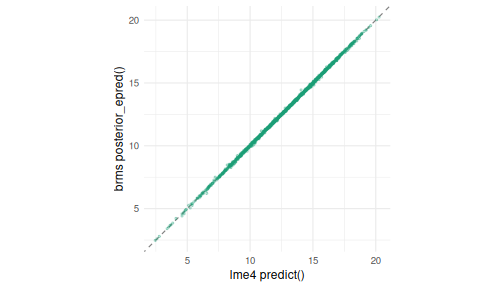
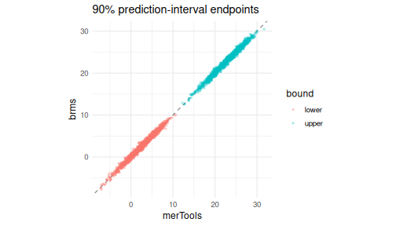
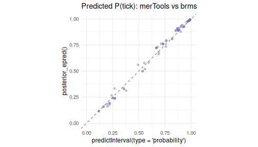

<style type="text/css">pre, pre code { white-space: pre-wrap !important; word-break: break-word; overflow-wrap: anywhere; }</style>


## Why compare to brms?

`merTools::predictInterval()` was written to put prediction intervals on
mixed-effect models that are too large or too slow to bootstrap. It does this by
simulating from the estimated distribution of the fixed and random effects --
fast, but an approximation. Since then, [brms](https://paulbuerkner.com/brms/)
has become a standard for *fully* Bayesian multilevel modeling, and its
posterior predictive distribution is about as close to a gold standard as we
have. This vignette asks a simple question: **how close are
`predictInterval()`'s intervals to the ones brms produces?**

We look at three things: a Gaussian random-slopes model, what happens for an
entirely unobserved group, and a binomial GLMM. This vignette is *precompiled* --
reproducing it requires the `brms` package and a working Stan toolchain.

## A random-slopes model

We use the bundled `hsb` data (7,185 students in 160 schools) and model math
achievement from student SES, school-mean SES, and a school-varying SES slope.
We hold out 20% of students for testing, plus six whole schools to stand in for
"new groups" later.


``` r
data(hsb)
hsb$schid <- factor(hsb$schid)
new_schools <- sample(levels(hsb$schid), 6)
hsb$.set <- "train"
hsb$.set[hsb$schid %in% new_schools] <- "test_new"
seen <- which(hsb$.set == "train")
hsb$.set[sample(seen, round(0.2 * length(seen)))] <- "test_seen"
train     <- droplevels(hsb[hsb$.set == "train", ])
test_seen <- hsb[hsb$.set == "test_seen" & hsb$schid %in% levels(train$schid), ]
test_new  <- hsb[hsb$.set == "test_new", ]

f1 <- mathach ~ ses + meanses + (ses | schid)
m_lme <- lmer(f1, data = train)
brms_fit_seconds <- system.time(
  m_brm <- fit_brm(f1, train, gaussian(), "brms_hsb_meanses"))[["elapsed"]]
```

We draw a predictive distribution for each held-out student from each method --
`predictInterval(returnSims = TRUE)` and `brms::posterior_predict()` -- and
compute everything (point estimates, intervals, coverage) from those draws.


``` r
mt_seen <- mt_draws(m_lme, test_seen)
pp_seen <- posterior_predict(m_brm, newdata = test_seen, allow_new_levels = TRUE)
```

### Point estimates are essentially identical

Both methods condition on the same estimated fixed effects and school BLUPs, so
the conditional-mean predictions should agree almost exactly -- and they do.


``` r
lme_mean <- predict(m_lme, newdata = test_seen)
brm_mean <- colMeans(posterior_epred(m_brm, newdata = test_seen, allow_new_levels = TRUE))
c(correlation = cor(lme_mean, brm_mean),
  mean_abs_diff = mean(abs(lme_mean - brm_mean)),
  response_sd = sd(test_seen$mathach))
#>   correlation mean_abs_diff   response_sd 
#>    0.99984045    0.03670134    6.71745425

ggplot(data.frame(merTools = lme_mean, brms = brm_mean), aes(merTools, brms)) +
  geom_abline(slope = 1, intercept = 0, linetype = 2, color = "grey50") +
  geom_point(alpha = 0.3, size = 0.8, color = "#1B9E77") + coord_equal() +
  labs(x = "lme4 predict()", y = "brms posterior_epred()") +
  theme_minimal(base_size = 12)
```

<div class="figure" style="text-align: center">

<p class="caption">plot of chunk point</p>
</div>

### The prediction intervals agree


``` r
b_mt <- qband(mt_seen, 0.90); b_brm <- qband(pp_seen, 0.90)
c(width_merTools = median(b_mt$upr - b_mt$lwr),
  width_brms = median(b_brm$upr - b_brm$lwr),
  cor_lower = cor(b_mt$lwr, b_brm$lwr),
  cor_upper = cor(b_mt$upr, b_brm$upr))
#> width_merTools     width_brms      cor_lower      cor_upper 
#>     20.1789145     20.2344075      0.9901934      0.9899334

endpts <- rbind(data.frame(bound = "lower", merTools = b_mt$lwr, brms = b_brm$lwr),
                data.frame(bound = "upper", merTools = b_mt$upr, brms = b_brm$upr))
ggplot(endpts, aes(merTools, brms, color = bound)) +
  geom_abline(slope = 1, intercept = 0, linetype = 2, color = "grey50") +
  geom_point(alpha = 0.3, size = 0.8) + coord_equal() +
  labs(title = "90% prediction-interval endpoints", x = "merTools", y = "brms") +
  theme_minimal(base_size = 12)
```

<div class="figure" style="text-align: center">

<p class="caption">plot of chunk intervals</p>
</div>

### And they are equally well calibrated

The real test is out-of-sample: do nominal intervals cover held-out scores at
the nominal rate? Both methods track the diagonal, and each other.


``` r
data.frame(nominal = NOMINAL,
           merTools = coverage(mt_seen, test_seen$mathach, NOMINAL),
           brms     = coverage(pp_seen, test_seen$mathach, NOMINAL))
#>   nominal  merTools      brms
#> 1    0.50 0.4569776 0.4598698
#> 2    0.80 0.7895879 0.7932032
#> 3    0.90 0.9168474 0.9168474
#> 4    0.95 0.9660159 0.9703543
```

### At a fraction of the cost


``` r
t_lme <- system.time(lmer(f1, data = train))[["elapsed"]]
t_mt  <- system.time(mt_draws(m_lme, test_seen))[["elapsed"]]
t_pp  <- system.time(posterior_predict(m_brm, newdata = test_seen,
                                       allow_new_levels = TRUE))[["elapsed"]]
data.frame(  # brms_fit_seconds was captured when the model was fit, above
  step = c("lme4 fit", "predictInterval", "brms fit (compile+sample)", "posterior_predict"),
  seconds = round(c(t_lme, t_mt, brms_fit_seconds, t_pp), 2))
#>                        step seconds
#> 1                  lme4 fit    0.06
#> 2           predictInterval    0.62
#> 3 brms fit (compile+sample)  406.37
#> 4         posterior_predict    1.69
```

For this model, the entire lme4 + `predictInterval()` path runs in about a
second, while a single brms fit takes several minutes -- a couple of orders of
magnitude difference, before the (much larger) models `predictInterval()` was
really built for.

## What about an entirely new group?

For a school that was never seen during fitting, `predictInterval()` falls back
to the fixed effects plus residual variation (it has no random effect to use),
while brms with `allow_new_levels = TRUE` draws a fresh school effect from the
estimated (co)variance. Whether that matters depends on how much variance is
left in the grouping factor -- which in turn depends on the fixed effects.

Here, `meanses` (a school-level fixed effect) already absorbs most of the
between-school variation, so the school random intercept is small and the two
methods stay close. Drop `meanses`, and the school variance -- and the gap --
grows:


``` r
new_group_gap <- function(form, cache) {
  ml <- lmer(form, data = train)
  mb <- fit_brm(form, train, gaussian(), cache)
  cov_mt  <- coverage(mt_draws(ml, test_new), test_new$mathach, 0.90)
  cov_brm <- coverage(posterior_predict(mb, newdata = test_new, allow_new_levels = TRUE),
                      test_new$mathach, 0.90)
  data.frame(school_SD = attr(VarCorr(ml)$schid, "stddev")[["(Intercept)"]],
             merTools_90 = cov_mt, brms_90 = cov_brm, gap = cov_brm - cov_mt)
}
rbind(`with meanses`    = new_group_gap(mathach ~ ses + meanses + (ses | schid), "brms_hsb_meanses"),
      `without meanses` = new_group_gap(mathach ~ ses + (ses | schid), "brms_hsb_nomeanses"))
#>                 school_SD merTools_90   brms_90        gap
#> with meanses     1.598503   0.8708487 0.8892989 0.01845018
#> without meanses  2.125770   0.8560886 0.8929889 0.03690037
```

The lesson is practical: `predictInterval()`'s new-group intervals are trustworthy
when the model's fixed effects explain most of the between-group variation, and
optimistic (too narrow) when they do not.

## A generalized linear mixed model

The story carries over to GLMMs. We fit a binomial model for whether grouse had
ticks and compare predicted probabilities -- `predictInterval(type =
"probability")` against `brms::posterior_epred()`.


``` r
data(grouseticks)
grouseticks$TICKS_BIN <- as.integer(grouseticks$TICKS >= 1)
grouseticks$cHEIGHT   <- as.numeric(scale(grouseticks$HEIGHT))
gk <- grouseticks
gk$.set <- ifelse(runif(nrow(gk)) < 0.2, "test", "train")
gk_tr <- droplevels(gk[gk$.set == "train", ])
gk_te <- gk[gk$.set == "test" & gk$BROOD %in% levels(gk_tr$BROOD) &
            gk$LOCATION %in% unique(gk_tr$LOCATION), ]

gf <- TICKS_BIN ~ YEAR + cHEIGHT + (1 | BROOD) + (1 | LOCATION)
g_lme <- glmer(gf, family = binomial, data = gk_tr,
               control = glmerControl(optimizer = "bobyqa"))
g_brm <- fit_brm(gf, gk_tr, bernoulli(), "brms_grouseticks")

mt_pr <- mt_draws(g_lme, gk_te, type = "probability", include.resid.var = FALSE)
if (max(mt_pr) > 1 || min(mt_pr) < 0) mt_pr <- plogis(mt_pr)
brm_pr <- posterior_epred(g_brm, newdata = gk_te, allow_new_levels = TRUE)
mt_p <- apply(mt_pr, 2, median); brm_p <- apply(brm_pr, 2, median)
c(correlation = cor(mt_p, brm_p), mean_abs_diff = mean(abs(mt_p - brm_p)))
#>   correlation mean_abs_diff 
#>    0.99607592    0.02315096

ggplot(data.frame(merTools = mt_p, brms = brm_p), aes(merTools, brms)) +
  geom_abline(slope = 1, intercept = 0, linetype = 2, color = "grey50") +
  geom_point(alpha = 0.4, color = "#7570B3") + coord_equal(xlim = c(0, 1), ylim = c(0, 1)) +
  labs(title = "Predicted P(tick): merTools vs brms",
       x = "predictInterval(type = 'probability')", y = "posterior_epred()") +
  theme_minimal(base_size = 12)
```

<div class="figure" style="text-align: center">

<p class="caption">plot of chunk glmm</p>
</div>

## Takeaways

- For **observed groups**, `predictInterval()` reproduces brms's point estimates
  and prediction intervals almost exactly, with the same out-of-sample coverage,
  at a tiny fraction of the computational cost.
- For **new groups**, `predictInterval()` omits the group effect; this is fine
  when fixed effects absorb most of the group variance and too narrow when they
  do not. Treat new-group intervals accordingly (see the `wiggle()` and
  `?predictInterval` documentation for ways to reason about unobserved levels).
- The same agreement holds for **GLMMs** on the probability scale.

In short, when bootstrapping or full MCMC is impractical, `predictInterval()` is
a fast, well-calibrated stand-in for the cases it was designed to handle.
