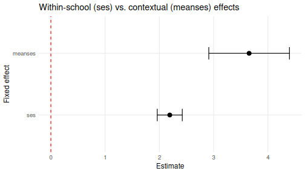
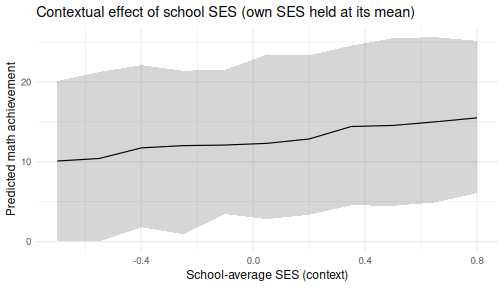
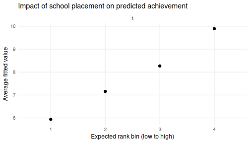

## Contextual effects

In a multilevel model, a predictor measured at the individual level can also be
aggregated to the group level, and the two can carry *different* meanings. The
classic example is socio-economic status (SES): a student's own SES captures a
*within-school* relationship, while the average SES of a student's school
captures a *contextual* (or *compositional*) effect -- the additional influence
of attending a more or less advantaged school, over and above a student's own
background.

This vignette reproduces the kind of analysis described in the `modelbased`
package's article ["Studying some effects in context"][modelbased] using the
tools in `merTools`. The data and model follow the contextual-effects example
that has long been used to teach multilevel modeling (Raudenbush and Bryk,
2002; Gelman and Hill, 2007).

[modelbased]: https://easystats.github.io/modelbased/articles/practical_context_effect.html

## The data

`merTools` ships with `hsb`, a subset of the 1982 *High School and Beyond*
survey: 7,185 students nested in 160
schools. It contains both a student-level SES measure (`ses`) and the
school-mean SES (`meanses`) -- exactly the pair we need to separate within-school
and contextual effects.


``` r
data(hsb)
str(hsb[, c("schid", "mathach", "ses", "meanses")])
#> 'data.frame':	7185 obs. of  4 variables:
#>  $ schid  : chr  "1224" "1224" "1224" "1224" ...
#>  $ mathach: num  5.88 19.71 20.35 8.78 17.9 ...
#>  $ ses    : num  -1.528 -0.588 -0.528 -0.668 -0.158 ...
#>  $ meanses: num  -0.428 -0.428 -0.428 -0.428 -0.428 -0.428 -0.428 -0.428 -0.428 -0.428 ...
```

## A contextual-effects model

We model math achievement as a function of a student's own SES and the average
SES of their school, allowing each school its own intercept:


``` r
cm <- lmer(mathach ~ ses + meanses + (1 | schid), data = hsb)
arm::display(cm)
#> lmer(formula = mathach ~ ses + meanses + (1 | schid), data = hsb)
#>             coef.est coef.se
#> (Intercept) 12.66     0.15  
#> ses          2.19     0.11  
#> meanses      3.68     0.38  
#> 
#> Error terms:
#>  Groups   Name        Std.Dev.
#>  schid    (Intercept) 1.64    
#>  Residual             6.08    
#> ---
#> number of obs: 7185, groups: schid, 160
#> AIC = 46578.6, DIC = 46559
#> deviance = 46563.8
```

The coefficient on `ses` is the *within-school* slope; the coefficient on
`meanses` is the *contextual* effect. `merTools::FEsim()` summarizes the
uncertainty in both, and `plotFEsim()` highlights the terms whose interval
excludes zero:


``` r
fe <- FEsim(cm, n.sims = 500)
plotFEsim(fe) +
  labs(title = "Within-school (ses) vs. contextual (meanses) effects")
```

<div class="figure" style="text-align: center">

<p class="caption">plot of chunk feplot</p>
</div>

## Predictions that separate the two effects

Because `meanses` enters the model directly, we can ask how the predicted math
score changes as we move a student across schools of differing average SES while
holding their own SES fixed. `wiggle()` builds the counterfactual data and
`predictInterval()` attaches prediction intervals:


``` r
# A median student in an average school
base_case <- draw(cm, type = "average")
scenarios <- wiggle(base_case, varlist = "meanses",
                    valueslist = list(seq(-0.7, 0.8, by = 0.15)))
pi <- predictInterval(cm, newdata = scenarios, level = 0.9, n.sims = 500,
                      seed = 11213)
scenarios <- cbind(scenarios, pi)

ggplot(scenarios, aes(x = meanses, y = fit, ymin = lwr, ymax = upr)) +
  geom_ribbon(alpha = 0.2) +
  geom_line() +
  labs(x = "School-average SES (context)", y = "Predicted math achievement",
       title = "Contextual effect of school SES (own SES held at its mean)") +
  theme_minimal(base_size = 12)
```

<div class="figure" style="text-align: center">

<p class="caption">plot of chunk wiggle</p>
</div>

## How much do schools matter across the rank distribution?

Finally, `REimpact()` summarizes how much being in a higher- versus
lower-performing school shifts the predicted outcome, binning schools by their
expected rank. `plotREimpact()` (new in this release) plots the result, and can
overlay several cases for comparison:


``` r
imp <- REimpact(cm, newdata = hsb[1, ], groupFctr = "schid",
                breaks = 4, n.sims = 500)
plotREimpact(imp) +
  labs(title = "Impact of school placement on predicted achievement")
```

<div class="figure" style="text-align: center">

<p class="caption">plot of chunk reimpact</p>
</div>

## References

Bates, D., Maechler, M., Bolker, B., and Walker, S. (2015). Fitting Linear
Mixed-Effects Models Using lme4. *Journal of Statistical Software*, 67(1),
1-48.

Gelman, A. and Hill, J. (2007). *Data Analysis Using Regression and
Multilevel/Hierarchical Models*. Cambridge University Press.

Lüdecke, D., et al. *modelbased: Studying some effects in context.* easystats.
<https://easystats.github.io/modelbased/articles/practical_context_effect.html>

Raudenbush, S. W. and Bryk, A. S. (2002). *Hierarchical Linear Models:
Applications and Data Analysis Methods* (2nd ed.). SAGE.
