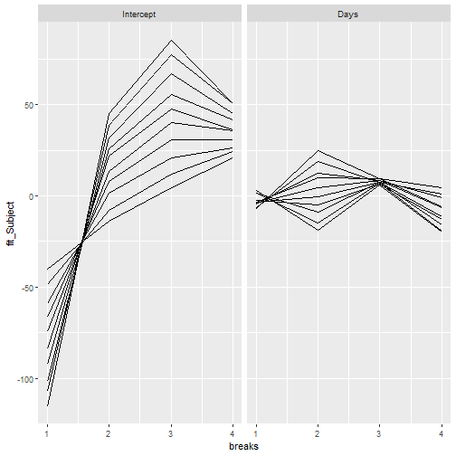

# Marginalizing Random Effects

One of the most common questions about multilevel models is how much influence grouping terms have
on the outcome. One way to explore this is to simulate the predicted values of an observation
across the distribution of random effects for a specific grouping variable and term. This can
be described as "marginalizing" predictions over the distribution of random effects. This allows
you to explore the influence of the grouping term and grouping levels on the outcome scale by
simulating predictions for simulated values of each observation across the distribution of
effect sizes.

The `REmargins()` function allows you to do this. Here, we take the example `sleepstudy` model and
marginalize predictions for all of the random effect terms (Subject:Intercept, Subject:Days). By
default, the function will marginalize over the *quartiles* of the expected rank (see expected
rank vignette) of the effect distribution for each term.


```r
fm1 <- lmer(Reaction ~ Days + (Days | Subject), sleepstudy)
mfx <- REmargins(merMod = fm1, newdata = sleepstudy[1:10,])
head(mfx)
#>   Reaction Days Subject case grouping_var      term breaks original_group_level
#> 1   249.56    0     309    1      Subject Intercept      1                  308
#> 2   249.56    0     334    1      Subject      Days      1                  308
#> 3   249.56    0     350    1      Subject Intercept      2                  308
#> 4   249.56    0     330    1      Subject      Days      2                  308
#> 5   249.56    0     308    1      Subject Intercept      3                  308
#> 6   249.56    0     332    1      Subject      Days      3                  308
#>   fit_combined upr_combined lwr_combined fit_Subject upr_Subject lwr_Subject fit_fixed
#> 1     209.3846     250.3619     174.2814  -40.366098   -4.412912   -74.60068  250.4405
#> 2     243.5345     281.7434     204.8201   -6.989358   29.806462   -46.97090  252.7202
#> 3     238.2613     275.8752     199.1572  -13.690991   20.343996   -54.49421  250.8008
#> 4     276.0049     310.5112     237.8415   24.923090   60.486658   -11.80239  252.5914
#> 5     253.5195     292.6832     216.2007    4.515485   39.504991   -32.36923  251.9662
#> 6     259.5311     297.3577     221.2943    9.540808   44.660050   -26.14103  252.0332
#>   upr_fixed lwr_fixed
#> 1  286.1343  217.3697
#> 2  287.0427  217.2515
#> 3  286.4434  217.6061
#> 4  286.7899  218.4882
#> 5  287.3253  218.4392
#> 6  287.9647  218.2303
```

The new data frame output from `REmargins` contains a lot of information. The first few columns
contain the original data passed to `newdata`. Each observation in `newdata` is identified by a
`case` number, because the function repeats each observation by the number of random effect terms
and number of breaks to simulate each term over. Then the `grouping_var`


# Summarizing


# Plotting

Finally - you can plot the results marginalization to evaluate the effect of the random effect terms
graphically.


```r
ggplot(mfx) + aes(x = breaks, y = fit_Subject, group = case) +
  geom_line() +
  facet_wrap(~term)
```



