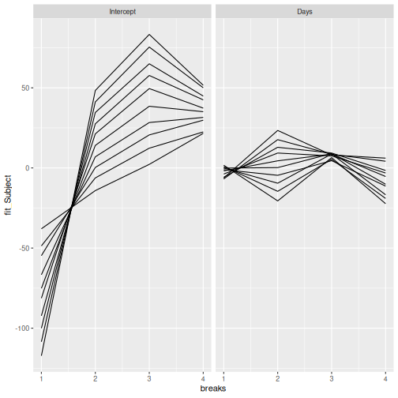

<style type="text/css">pre, pre code { white-space: pre-wrap !important; word-break: break-word; overflow-wrap: anywhere; }</style>


# Marginalizing Random Effects

One of the most common questions about multilevel models is how much influence grouping terms have
on the outcome. One way to explore this is to simulate the predicted values of an observation
across the distribution of random effects for a specific grouping variable and term. This can
be described as "marginalizing" predictions over the distribution of random effects. This allows
you to explore the influence of the grouping term and grouping levels on the outcome scale by
simulating predictions for simulated values of each observation across the distribution of
effect sizes.

The `REmargins()` function allows you to do this. Here, we take the example `sleepstudy` model and
marginalize predictions for all of the random effect terms (Subject:Intercept, Subject:Days). By
default, the function will marginalize over the *quartiles* of the expected rank (see expected
rank vignette) of the effect distribution for each term.


``` r
fm1 <- lmer(Reaction ~ Days + (Days | Subject), sleepstudy)
mfx <- REmargins(merMod = fm1, newdata = sleepstudy[1:10,])
head(mfx)
#>   Reaction Days Subject case grouping_var      term breaks original_group_level
#> 1   249.56    0     309    1      Subject Intercept      1                  308
#> 2   249.56    0     334    1      Subject      Days      1                  308
#> 3   249.56    0     350    1      Subject Intercept      2                  308
#> 4   249.56    0     330    1      Subject      Days      2                  308
#> 5   249.56    0     308    1      Subject Intercept      3                  308
#> 6   249.56    0     332    1      Subject      Days      3                  308
#>   fit_combined upr_combined lwr_combined fit_Subject upr_Subject lwr_Subject
#> 1     211.9200     250.8137     173.6175  -37.958384   -2.680876   -76.85914
#> 2     245.6775     283.3831     207.7996   -6.238617   25.164606   -46.69958
#> 3     236.9896     275.3616     201.5464  -14.117588   21.020768   -51.19104
#> 4     273.9680     311.3997     236.0823   23.409186   59.360085   -13.18793
#> 5     254.5492     290.2708     218.4986    2.253723   35.755512   -32.79586
#> 6     263.1717     296.7733     225.2313    8.055660   43.478246   -27.57725
#>   fit_fixed upr_fixed lwr_fixed
#> 1  252.4671  288.5500  219.3783
#> 2  250.5605  287.2176  215.9889
#> 3  252.2250  290.5297  217.9524
#> 4  253.0412  287.3219  217.2943
#> 5  250.6383  284.8410  216.6404
#> 6  252.7486  286.7932  218.2970
```

The new data frame output from `REmargins` contains a lot of information. The first few columns
contain the original data passed to `newdata`. Each observation in `newdata` is identified by a
`case` number, because the function repeats each observation by the number of random effect terms
and number of breaks to simulate each term over. Then the `grouping_var`


# Summarizing


# Plotting

Finally - you can plot the results marginalization to evaluate the effect of the random effect terms
graphically.


``` r
ggplot(mfx) + aes(x = breaks, y = fit_Subject, group = case) +
  geom_line() +
  facet_wrap(~term)
```



