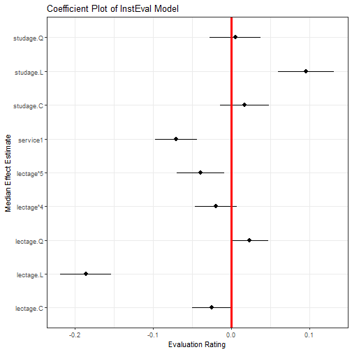
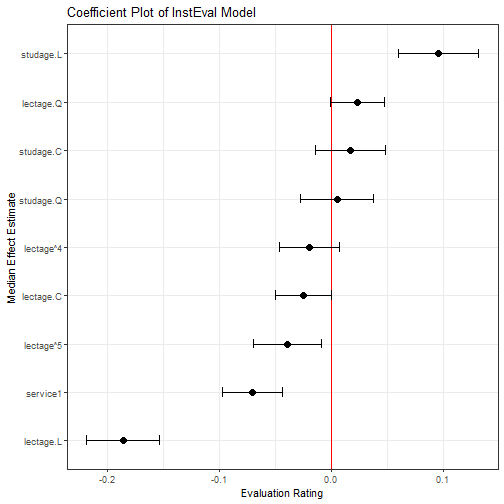
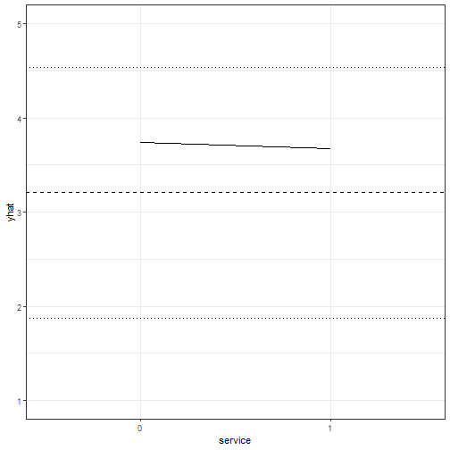
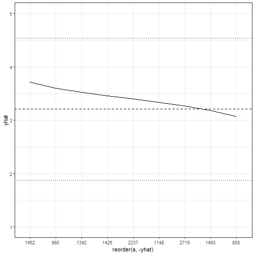
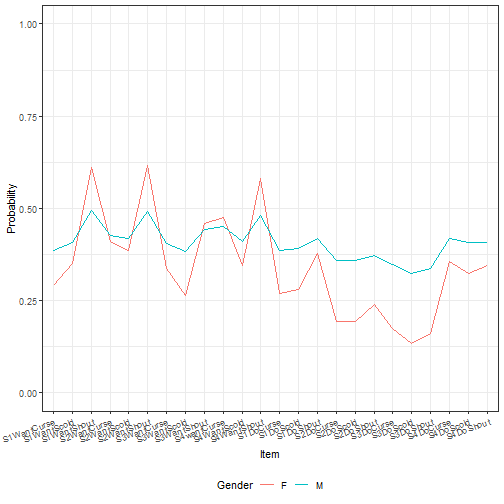
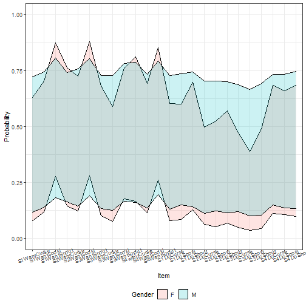

## Introduction

Working with generalized linear mixed models (GLMM) and linear mixed models (LMM)
has become increasingly easy with the advances in the `lme4` package recently.
As we have found ourselves using these models more and more within our work, we,
the authors, have developed a set of tools for simplifying and speeding up common
tasks for interacting with `merMod` objects from `lme4`. This package provides
those tools.

## Illustrating Model Effects

As the complexity of the model fit grows, it becomes harder and harder to
interpret the substantive effect of parameters in the model.

Let's start with a medium-sized example model using the `InstEval` data provided
by the `lme4` package. These data represent university lecture evaluations at
ETH Zurich made by students. In this data, `s` is an individual student,
`d` is an individual lecturer, `studage` is the semester the student
is enrolled, `lectage` is how many semesters back the lecture with the
rating took place, `dept` is the department of the lecture, and `y` is an integer
1:5 representing the ratings of the lecture from "poor" to "very good":


```r
library(lme4)
head(InstEval)
#>   s    d studage lectage service dept y
#> 1 1 1002       2       2       0    2 5
#> 2 1 1050       2       1       1    6 2
#> 3 1 1582       2       2       0    2 5
#> 4 1 2050       2       2       1    3 3
#> 5 2  115       2       1       0    5 2
#> 6 2  756       2       1       0    5 4
str(InstEval)
#> 'data.frame':	73421 obs. of  7 variables:
#>  $ s      : Factor w/ 2972 levels "1","2","3","4",..: 1 1 1 1 2 2 3 3 3 3 ...
#>  $ d      : Factor w/ 1128 levels "1","6","7","8",..: 525 560 832 1068 62 406 3 6 19 75 ...
#>  $ studage: Ord.factor w/ 4 levels "2"<"4"<"6"<"8": 1 1 1 1 1 1 1 1 1 1 ...
#>  $ lectage: Ord.factor w/ 6 levels "1"<"2"<"3"<"4"<..: 2 1 2 2 1 1 1 1 1 1 ...
#>  $ service: Factor w/ 2 levels "0","1": 1 2 1 2 1 1 2 1 1 1 ...
#>  $ dept   : Factor w/ 14 levels "15","5","10",..: 14 5 14 12 2 2 13 3 3 3 ...
#>  $ y      : int  5 2 5 3 2 4 4 5 5 4 ...
```

Starting with a simple model:


```r
m1 <- lmer(y ~ service + lectage + studage + (1|d) + (1|s), data=InstEval)
```

After fitting the model we can make use of the first function provided by
`merTools`, `fastdisp` which modifies the function `arm:::display` to more
quickly display a summary of the model without calculating the model sigma:


```r
library(merTools)
fastdisp(m1)
#> lmer(formula = y ~ service + lectage + studage + (1 | d) + (1 | 
#>     s), data = InstEval)
#>             coef.est coef.se
#> (Intercept)  3.22     0.02  
#> service1    -0.07     0.01  
#> lectage.L   -0.19     0.02  
#> lectage.Q    0.02     0.01  
#> lectage.C   -0.02     0.01  
#> lectage^4   -0.02     0.01  
#> lectage^5   -0.04     0.02  
#> studage.L    0.10     0.02  
#> studage.Q    0.01     0.02  
#> studage.C    0.02     0.02  
#> 
#> Error terms:
#>  Groups   Name        Std.Dev.
#>  s        (Intercept) 0.33    
#>  d        (Intercept) 0.52    
#>  Residual             1.18    
#> ---
#> number of obs: 73421, groups: s, 2972; d, 1128
#> AIC = 237655
```

We see some interesting effects. First, our decision to include student and
lecturer effects seems justified as there is substantial variance within these
groups. Second, there do appear to be some effects by age and for lectures
given as a service by an outside lecturer. Let's look at these in more detail.
One way to do this would be to plot the coefficients together in a line to
see which deviate from 0 and in what direction. To get a confidence interval
for our fixed effect coefficients we have a number of options that represent a
tradeoff between coverage and computation time -- see `confint.merMod` for
details.

An alternative is to simulate values of the fixed effects from the posterior
using the function `arm::sim`. Our next tool, `FEsim`, is a convenience wrapper
to do this and provide an informative data frame of the results.


```r
feEx <- FEsim(m1, 1000)
cbind(feEx[,1] , round(feEx[, 2:4], 3))
#>      feEx[, 1]   mean median    sd
#> 1  (Intercept)  3.225  3.225 0.020
#> 2     service1 -0.070 -0.070 0.013
#> 3    lectage.L -0.186 -0.186 0.017
#> 4    lectage.Q  0.024  0.024 0.012
#> 5    lectage.C -0.025 -0.025 0.013
#> 6    lectage^4 -0.020 -0.019 0.014
#> 7    lectage^5 -0.039 -0.039 0.015
#> 8    studage.L  0.096  0.096 0.018
#> 9    studage.Q  0.005  0.005 0.017
#> 10   studage.C  0.017  0.017 0.016
```

We can present these results graphically, using `ggplot2`:


```r
library(ggplot2)
ggplot(feEx[feEx$term!= "(Intercept)", ]) +
  aes(x = term, ymin = median - 1.96 * sd,
      ymax = median + 1.96 * sd, y = median) +
  geom_pointrange() +
  geom_hline(yintercept = 0, size = I(1.1), color = I("red")) +
  coord_flip() +
  theme_bw() + labs(title = "Coefficient Plot of InstEval Model",
                    x = "Median Effect Estimate", y = "Evaluation Rating")
```



However, an easier option is:


```r
plotFEsim(feEx) +
  theme_bw() + labs(title = "Coefficient Plot of InstEval Model",
                    x = "Median Effect Estimate", y = "Evaluation Rating")
```



## Random Effects

Next, we might be interested in exploring the random effects. Again, we create a
dataframe of the values of the simulation of these effects for the individual
levels.


```r
reEx <- REsim(m1)
head(reEx)
#>   groupFctr groupID        term        mean      median        sd
#> 1         s       1 (Intercept)  0.18042888  0.21906223 0.3145710
#> 2         s       2 (Intercept) -0.07034954 -0.06339508 0.2972897
#> 3         s       3 (Intercept)  0.32105622  0.33625741 0.3187445
#> 4         s       4 (Intercept)  0.23713963  0.23271723 0.2761635
#> 5         s       5 (Intercept)  0.02613185  0.02878794 0.3054642
#> 6         s       6 (Intercept)  0.10806580  0.11082677 0.2429651
```

The result is a dataframe with estimates of the values of each of the random
effects provided by the `arm::sim()` function. *groupID* represents the identfiable
level for the variable for one random effect, *term* represents whether the
simulated values are for an intercept or which slope, and *groupFctr* identifies
which of the `(1|x)` terms the values represent. To make unique identifiers
for each term, we need to use both the `groupID` and the `groupFctr` term in case
these two variables use overlapping label names for their groups. In this case:


```r
table(reEx$term)
#> 
#> (Intercept) 
#>        4100
table(reEx$groupFctr)
#> 
#>    d    s 
#> 1128 2972
```

Most important is producing caterpillar or dotplots of these terms to explore
their variation. This is easily accomplished with the `dotplot` function:


```r
lattice::dotplot(ranef(m1, condVar=TRUE))
```

However, these graphics do not provide much control over the results. Instead,
we can use the `plotREsim` function in `merTools` to gain more control over
plotting of the random effect simulations.


```r
p1 <- plotREsim(reEx)
p1
```


The result is a ggplot2 object which can be modified however the user sees
fit. Here, we've established that most student and professor effects are
indistinguishable from zero, but there do exist extreme outliers with both
high and low averages that need to be accounted for.

## Subtantive Effects

A logical next line of questioning is to see how much of the variation in a
rating can be caused by changing the student rater and how much is due to the
fixed effects we identified above. This is a very difficult problem to solve,
but using simulation we can examine the model behavior under a range of scenarios
to understand how the model is reflecting changes in the data. To do this,
we use another set of functions available in `merTools`.

The simplest option is to pick an observation at random and then modify its
values deliberately to see how the prediction changes in response. `merTools`
makes this task very simple:


```r
example1 <- draw(m1, type = 'random')
head(example1)
#>       y service lectage studage   d    s
#> 29762 1       0       1       4 403 1208
```

The `draw` function takes a random observation from the data in the model
and extracts it as a dataframe. We can now do a number of operations to this
observation:


```r
# predict it
predict(m1, newdata = example1)
#>    29762 
#> 3.742122
# change values
example1$service <- "1"
predict(m1, newdata = example1)
#>    29762 
#> 3.671278
```

More interesting, let's programatically modify this observation to see how the
predicted value changes if we hold everything but one variable constant.


```r
example2 <- wiggle(example1, varlist = "lectage",
          valueslist = list(c("1", "2", "3", "4", "5", "6")))

example2
#>        y service lectage studage   d    s
#> 29762  1       1       1       4 403 1208
#> 297621 1       1       2       4 403 1208
#> 297622 1       1       3       4 403 1208
#> 297623 1       1       4       4 403 1208
#> 297624 1       1       5       4 403 1208
#> 297625 1       1       6       4 403 1208
```

The function `wiggle` allows us to create a new dataframe with copies of the
variable that modify just one value. Chaining together `wiggle` calls, we
can see how the variable behaves under a number of different scenarios
simultaneously.


```r
example2$yhat <- predict(m1, newdata = example2)

ggplot(example2, aes(x = lectage, y = yhat)) + geom_line(aes(group = 1)) +
  theme_bw() + ylim(c(1, 5)) +
  geom_hline(yintercept = mean(InstEval$y), linetype = 2) +
  geom_hline(yintercept = mean(InstEval$y) + sd(InstEval$y), linetype = 3) +
  geom_hline(yintercept = mean(InstEval$y) - sd(InstEval$y), linetype = 3)
```


The result allows us to graphically display the effect of each level of `lectage`
on an observation that is otherwise identical. This is plotted here against a
horizontal line representing the mean of the observed ratings, and two finer
lines showing plus or minus one standard deviation of the mean.

This is nice, but selecting a random observation is not very satisfying as it
may not be very meaningful. To address this, we can instead take the average
observation:


```r
example3 <- draw(m1, type = 'average')
example3
#>          y service lectage studage    d    s
#> 1 3.205745       0       1       6 1510 2237
```

Here, the average observation is identified based on either the modal observation
for factors or on the mean for numeric variables. Then, the random effect
terms are set to the level equivalent to the median effect -- very close
to 0.


```r
example3 <- wiggle(example1, varlist = "service",
          valueslist = list(c("0", "1")))
example3$yhat <- predict(m1, newdata = example3)

ggplot(example3, aes(x = service, y = yhat)) + geom_line(aes(group = 1)) +
  theme_bw() + ylim(c(1, 5)) +
  geom_hline(yintercept = mean(InstEval$y), linetype = 2) +
  geom_hline(yintercept = mean(InstEval$y) + sd(InstEval$y), linetype = 3) +
  geom_hline(yintercept = mean(InstEval$y) - sd(InstEval$y), linetype = 3)
```



Here we can see that for the average observation, whether the lecture is outside
of the home department has a very slight negative effect on the overall rating.
Might the individual professor or student have more of an impact on the overall
rating? To answer this question we need to wiggle the same observation across
a wide range of student or lecturer effects.

How do we identify this range? `merTools` provides the `REquantile` function
which helps to identify which levels of the grouping terms correspond to which
quantile of the magnitude of the random effects:


```r
REquantile(m1, quantile = 0.25, groupFctr = "s")
#> [1] "446"
REquantile(m1, quantile = 0.25, groupFctr = "d")
#> [1] "18"
```

Here we can see that group level 446
corresponds to the 25th percentile of the effect for the student groups, and level
`REquantile(m1, quantile = 0.25, groupFctr = "d")` corresponds to the 25th
percentile for the instructor group. Using this information we can reassign
a specific observation to varying magnitudes of grouping term effects to see
how much they might influence our final prediction.


```r
example4 <- draw(m1, type = 'average')
example4 <- wiggle(example4, varlist = "s",
                      list(REquantile(m1, quantile = seq(0.1, 0.9, .1),
                                 groupFctr = "s")))

example4$yhat <- predict(m1, newdata = example4)

ggplot(example4, aes(x = reorder(s, -yhat), y = yhat)) +
  geom_line(aes(group = 1)) +
  theme_bw() + ylim(c(1, 5)) +
  geom_hline(yintercept = mean(InstEval$y), linetype = 2) +
  geom_hline(yintercept = mean(InstEval$y) + sd(InstEval$y), linetype = 3) +
  geom_hline(yintercept = mean(InstEval$y) - sd(InstEval$y), linetype = 3)
```



This figure is very interesting because it shows that moving across the range
of student effects can have a larger impact on the score than the fixed effects
we observed above. That is, getting a "generous" or a "stingy" rater can have
a substantial impact on the final rating.

But, we can do even better. First, we can move beyond the average observation
by taking advantage of the `varList` option to the function which allows us to
specify a subset of the data to compute an average for.


```r
subExample <- list(studage = "2", lectage = "4")
example5 <- draw(m1, type = 'average', varList = subExample)
example5
#>          y service lectage studage    d    s
#> 1 3.087193       0       4       2 1510 2237
```

Now we have the average observation with a student age of 2 and a lecture age
of 4. We can then follow the same procedure as before to explore the effects
on our subsamples. Before we do that, let's fit a slightly more complex model
that includes a random slope.


```r
data(VerbAgg)
m2 <- glmer(r2 ~ Anger + Gender + btype + situ +
                (1|id) + (1 + Gender|item), family = binomial,
              data = VerbAgg)

example6 <- draw(m2, type = 'average', varList = list("id" = "149"))
example6$btype <- "scold"
example6$situ <- "self"


tempdf <- wiggle(example6, varlist = "Gender", list(c("M", "F")))
tempdf <- wiggle(tempdf, varlist = "item",
                    list(unique(VerbAgg$item)))
tempdf$yhat <- predict(m2, newdata = tempdf, type = "response",
                       allow.new.levels = TRUE)

ggplot(tempdf, aes(x = item, y = yhat, group = Gender)) +
  geom_line(aes(color = Gender))+
  theme_bw() + ylim(c(0, 1)) +
  theme(axis.text.x = element_text(angle = 20, hjust=1),
        legend.position = "bottom") + labs(x = "Item", y = "Probability")
```



Here we've shown that the effect of both the intercept and the gender slope on
item simultaneously affect our predicted value. This results in the two lines
for predicted values across the items not being parallel. While we can see this
by looking at the results of the summary of the model object, using `fastdisp`
in the `merTools` package for larger models, it is not intuitive what that
effect looks like across different scenarios. `merTools` has given us the
machinery to investigate this.

## Uncertainty

The above examples make use of simulation to show the model behavior after
changing some values in a dataset. However, until now, we've focused on using
point estimates to represent these changes. The use of predicted point estimates
without incorporating any uncertainty can lead to overconfidence in the precision
of the model.

In the `predictInterval` function, discussed in more detail in another package
vignette, we provide a way to incorporate three out of the four types of
uncertainty inherent in a model. These are:

1. Overall model uncertainty
2. Uncertainty in fixed effect values
3. Uncertainty in random effect values
4. Uncertainty in the distribution of the random effects

1-3 are incorporated in the results of `predictInterval`, while capturing 4
would require making use of the `bootMer` function -- options discussed in
greater detail elsewhere. The main advantage of `predictInterval` is that it is
fast. By leveraging the power of the `arm::sim()` function, we are able to
generate prediction intervals for individual observations from very large models
very quickly. And, it works a lot like `predict`:


```r
exampPreds <- predictInterval(m2, newdata = tempdf,
                              type = "probability", level = 0.8)

tempdf <- cbind(tempdf, exampPreds)

ggplot(tempdf, aes(x = item, y = fit, ymin = lwr, ymax = upr,
                   group = Gender)) +
  geom_ribbon(aes(fill = Gender), alpha = I(0.2), color = I("black"))+
  theme_bw() + ylim(c(0, 1)) +
  theme(axis.text.x = element_text(angle = 20),
        legend.position = "bottom")+ labs(x = "Item", y = "Probability")
```



Here we can see there is barely any gender difference in terms of area of
potential prediction intervals. However, by default, this approach includes the
residual variance of the model. If we instead focus just on the uncertainty of
the random and fixed effects, we get:


```r
exampPreds <- predictInterval(m2, newdata = tempdf,
                              type = "probability",
                              include.resid.var = FALSE, level = 0.8)
tempdf <- cbind(tempdf[, 1:8], exampPreds)

ggplot(tempdf, aes(x = item, y = fit, ymin = lwr, ymax = upr,
                   group = Gender)) +
  geom_ribbon(aes(fill = Gender), alpha = I(0.2), color = I("black"))+
  geom_line(aes(color = Gender)) +
  theme_bw() + ylim(c(0, 1)) +
  theme(axis.text.x = element_text(angle = 20),
        legend.position = "bottom") + labs(x = "Item", y = "Probability")
```


Here, more difference emerges, but we see that the differences are not very
precise.
